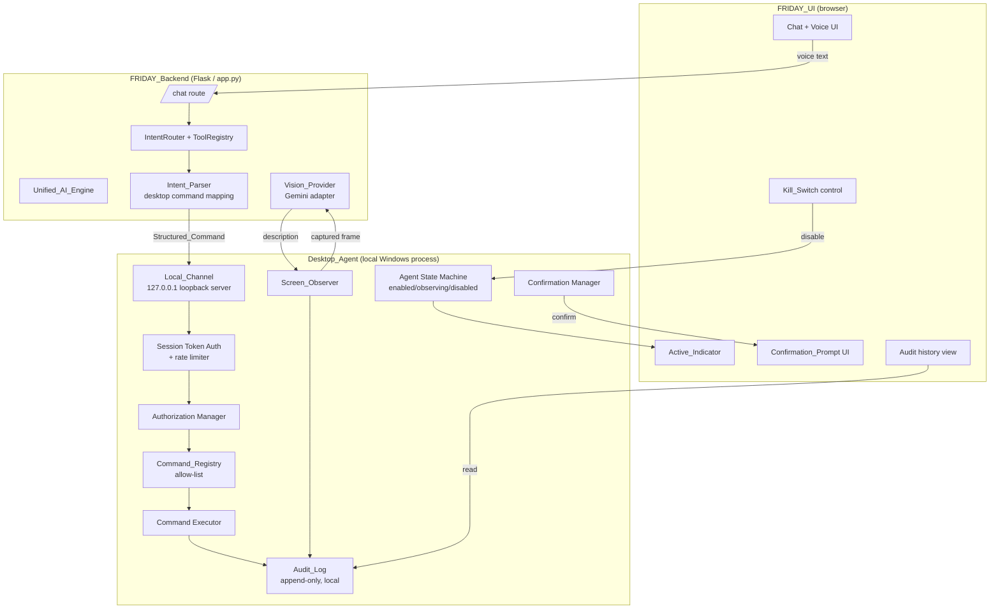
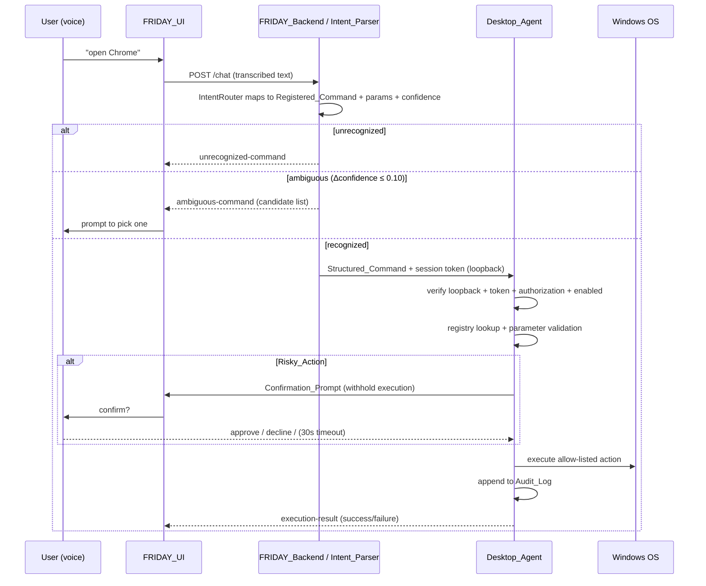

# Design Document

## Overview

The FRIDAY Desktop Agent introduces a new **local native process** that runs on the user's Windows PC and executes explicitly allow-listed operating-system actions on behalf of the existing FRIDAY assistant. Today FRIDAY is a Flask web application (`app.py`, deployed on Vercel) with a browser UI (`public/index.html`), a multi-provider AI engine (`friday/modules/providers/`), and an LLM-driven `IntentRouter` with a tool-calling system (`friday/modules/tool_calling/`). Because a browser or cloud-hosted app cannot control the host OS, this feature adds a separate agent process that the FRIDAY UI talks to over a loopback-only channel.

The design has three guiding principles that come directly from the requirements:

1. **Least privilege by construction** — the agent can only execute actions that appear in an explicit `Command_Registry` allow-list. Arbitrary shell strings are rejected structurally, not filtered.
2. **Local-only, authenticated transport** — the command interface binds exclusively to `127.0.0.1`, rejects non-loopback connections, and requires a high-entropy, expiring per-session token on every request.
3. **User-in-control** — explicit authorization before any action, confirmation for risky actions, a always-visible active indicator, an instant kill-switch, and a complete local append-only audit log.

The agent reuses the existing AI engine and `IntentRouter` for natural-language understanding (intent parsing runs in the FRIDAY backend), and reuses the Gemini vision-capable provider for the opt-in screen-awareness feature. The desktop agent itself is written in **Python** to match the rest of the codebase (and to reuse dataclass/validation patterns from `friday/modules/`), packaged as a standalone process the user launches locally.

### Scope Boundaries

- **In scope:** launching apps, opening files/folders, web search, media control, dictation, window management, locking the PC, opt-in screen awareness, audit logging, kill-switch, active-state indication, loopback-only authenticated transport.
- **Explicit non-goals (enforced, not just documented):** unlocking the PC, bypassing the OS lock screen or login, and storing OS credentials. These are excluded from the `Command_Registry` and actively declined.

## Architecture

The system spans three cooperating tiers. The two existing tiers (FRIDAY_UI and FRIDAY_Backend) gain small additions; the Desktop_Agent is entirely new and runs on the user's machine.



### Request Lifecycle (voice command → action)



### Trust and Enforcement Layers

Every inbound command passes through an ordered gauntlet in the Desktop_Agent. Each layer can reject and record the rejection in the Audit_Log; only a request that passes all layers reaches the OS:

1. **Transport origin check** — connection must originate from `127.0.0.1` (Req 1.3, 11.1, 11.2).
2. **Session token check** — a valid, unexpired token with ≥128 bits of entropy must be present (Req 1.4–1.6, 11.3–11.5); repeated failures trigger a lockout (Req 1.7).
3. **Enabled / kill-switch check** — agent must not be disabled (Req 8.5).
4. **Authorization check** — `User_Authorization` must be present (Req 2.1, 2.2).
5. **Registry allow-list check** — the referenced `Registered_Command` must exist; raw shell strings are unsupported (Req 3.2–3.4).
6. **Parameter validation** — parameters must satisfy the command's schema (Req 3.6).
7. **Risk gate** — a `Risky_Action` requires an approved `Confirmation_Prompt` before execution (Req 6.1–6.5).
8. **Execution + audit** — execute via the OS handler and record the outcome (Req 4.x, 7.1).

### Technology Choices

- **Language/runtime:** Python 3 (matches existing `friday/` modules; reuses immutable-dataclass modeling and Hypothesis-based property testing already in `tests/`).
- **Local channel:** an HTTP server bound to `127.0.0.1` using Python's standard library (`http.server`) or a lightweight framework, with a WebSocket upgrade optional for push notifications (confirmation prompts, state changes). Binding to the loopback address is the primary network-exposure control.
- **Windows OS integration:** `os.startfile`/`subprocess` for launching apps and opening files/folders, `webbrowser` for web search, `ctypes`/Win32 (`user32`) for window management and locking the session (`LockWorkStation`), and a keyboard-injection library for dictation. Each is wrapped behind a `Registered_Command` executor so the OS surface is only reachable through the allow-list.
- **Token generation:** `secrets.token_urlsafe(32)` yields 256 bits of entropy, comfortably above the 128-bit floor (Req 1.4).
- **Vision:** the existing Gemini adapter (`friday/modules/providers/adapters/gemini_adapter.py`, `supports_vision=True`) serves as the `Vision_Provider`.
- **Audit log storage:** a local append-only file (JSON Lines) in the agent's data directory, mirroring the existing local-storage convention (`.friday-data/`).

## Components and Interfaces

### FRIDAY_Backend additions

#### Intent_Parser (desktop command mapping)
Runs inside the backend, layered on the existing `IntentRouter`/`ToolRegistry`. A new set of desktop tool definitions (launch app, open path, web search, media control, dictation, window management, lock PC) is registered so the existing LLM tool-selection flow can map free text to a `Registered_Command` identifier and validated parameters.

- `parse_intent(text: str) -> IntentResult` — returns a `Structured_Command` with a confidence value in `[0.0, 1.0]` (Req 5.1, 5.5), an `unrecognized-command` status when nothing maps (Req 5.2), or an `ambiguous-command` status listing candidates when the top two candidates' confidence differ by ≤ 0.10 (Req 5.3, 5.4).

The parser does **not** execute anything; it only produces a `Structured_Command` to forward to the agent.

#### Desktop Agent client bridge
A thin backend/UI client that forwards a `Structured_Command` to the Desktop_Agent over the Local_Channel, attaching the current session token, and relays the `execution-result`, `authorization-required`, `disabled`, `unsupported-command`, or `validation-error` statuses back to the UI.

### Desktop_Agent components

#### Local_Channel (loopback server)
- Binds a listening socket to `127.0.0.1` only (Req 1.2, 11.1).
- `is_loopback(remote_addr) -> bool` gate rejects any non-loopback origin and records it (Req 1.3, 11.2).
- Exposes command, authorization, kill-switch, screen-awareness, and audit-history endpoints.

#### Session Token Authenticator
- `issue_token() -> SessionToken` — creates a token with ≥128 bits of entropy and an expiry ≤ 3600s from issuance (Req 1.4, 1.6).
- `validate_token(presented, now) -> AuthResult` — rejects missing/invalid/expired tokens (Req 1.5, 11.3–11.5).
- `register_failure(now)` / `is_locked_out(now)` — after >5 invalid tokens within 60s, refuse new connections for ≥60s (Req 1.7).

#### Authorization Manager
- Holds `User_Authorization` state and scope; `require_authorization()` gate blocks all execution while absent (Req 2.1, 2.2).
- `grant(scope, now)` records the authorization event, scope, and timestamp (Req 2.4).
- `revoke(now)` stops accepting commands within 1s (Req 2.5).

#### Command_Registry
- Immutable allow-list of `Registered_Command` entries, each with an identifier, parameter schema, and risk classification (`standard` | `risky`) (Req 3.1, 3.5).
- `lookup(command_id) -> Registered_Command | None` (Req 3.2, 3.3).
- Excludes, by construction, any command whose purpose is to unlock the PC or bypass OS authentication (Req 12.4).

#### Parameter Validator
- Reuses the validation approach from `tool_calling/router.py::_validate_parameters` (required fields, string length bounds, enum membership) plus numeric range checks (e.g., volume constrained to `[0, 100]`, Req 4.4). Returns a `validation-error` on failure (Req 3.6).

#### Command Executor
- Dispatches a validated `Structured_Command` to the matching OS handler: launch app (4.1), open file/folder via default handler (4.2), web search in default browser (4.3), media control incl. volume clamp (4.4), dictation into active input (4.5), window management (4.6), lock PC (4.7).
- Returns an `execution-result` status indicating success or failure (Req 4.8).

#### Confirmation Manager
- For a `Risky_Action`, raises a `Confirmation_Prompt` and withholds execution while pending (Req 6.1, 6.2).
- Resolves on approve (execute + record, Req 6.3), decline (cancel + record, Req 6.4), or 30s timeout (cancel + record, Req 6.5).

#### Screen_Observer (opt-in)
- Disabled by default; never captures while disabled (Req 10.1).
- Requires explicit opt-in consent before the first capture (Req 10.2, 10.3).
- On capture, sends content to the Vision_Provider (Req 10.4), records the capture event + timestamp (Req 10.8), and retains the frame only until the response returns, then discards it (Req 10.9).
- On vision failure: discard frame, return `vision-unavailable`, record failure (Req 10.5).
- Stops capturing within 1s of disable/kill-switch (Req 10.7, 8.3).

#### Audit_Log
- Append-only local store (Req 7.2, 7.4). `append(entry)` never mutates or removes prior entries.
- Records executions (id, params, outcome, timestamp — Req 7.1), declines (command, reason, timestamp — Req 7.3), authorization/kill-switch/capture/lockout events.
- `read_reverse_chronological()` powers the UI history view (Req 7.5).

#### Agent State Machine
- States: `enabled`, `observing`, `disabled`. Drives the Active_Indicator (Req 9.1–9.4) and enforces the kill-switch disabled behavior (Req 8.2, 8.5).
- Transitions publish to the UI within 1s (Req 9.4).

### FRIDAY_UI additions
- **Active_Indicator** reflecting enabled/observing/disabled (Req 9.x).
- **Kill_Switch** control (Req 8.1).
- **Confirmation_Prompt** dialog for risky actions (Req 6.1).
- **Command history** view rendering the Audit_Log in reverse chronological order (Req 7.5).
- **Ambiguity/unrecognized** prompts surfaced from the Intent_Parser (Req 5.2, 5.4).

## Data Models

The agent uses immutable dataclasses consistent with `friday/modules/tool_calling/models.py` and `friday/modules/providers/models.py`.

```python
from dataclasses import dataclass, field
from enum import Enum
from typing import Any, Optional


class RiskClass(Enum):
    STANDARD = "standard"
    RISKY = "risky"


class CommandStatus(Enum):
    SUCCESS = "success"
    FAILURE = "failure"
    UNSUPPORTED = "unsupported-command"
    VALIDATION_ERROR = "validation-error"
    AUTHORIZATION_REQUIRED = "authorization-required"
    DISABLED = "disabled"
    UNRECOGNIZED = "unrecognized-command"
    AMBIGUOUS = "ambiguous-command"
    VISION_UNAVAILABLE = "vision-unavailable"


class AgentState(Enum):
    ENABLED = "enabled"
    OBSERVING = "observing"
    DISABLED = "disabled"


@dataclass(frozen=True)
class RegisteredCommand:
    """An entry in the Command_Registry allow-list."""
    command_id: str
    description: str
    parameters: dict[str, Any]      # JSON Schema, "type": "object"
    risk_class: RiskClass           # standard | risky (Req 3.5)
    handler_name: str               # OS handler that executes it


@dataclass(frozen=True)
class StructuredCommand:
    """Machine-readable user intent forwarded to the agent."""
    command_id: str                 # references a RegisteredCommand (Req 5.1)
    parameters: dict[str, Any]
    confidence: float               # in [0.0, 1.0] (Req 5.5)


@dataclass(frozen=True)
class IntentResult:
    """Output of the Intent_Parser."""
    status: CommandStatus
    command: Optional[StructuredCommand] = None
    candidates: list[StructuredCommand] = field(default_factory=list)  # ambiguous (Req 5.3)


@dataclass(frozen=True)
class SessionToken:
    """Per-session authentication token."""
    value: str                      # ≥128 bits entropy (Req 1.4)
    issued_at: float                # epoch seconds
    expires_at: float               # ≤ issued_at + 3600 (Req 1.6)


@dataclass(frozen=True)
class AuthResult:
    valid: bool
    reason: Optional[str] = None    # "missing" | "invalid" | "expired"


@dataclass(frozen=True)
class ExecutionResult:
    """Result returned to the FRIDAY_UI (Req 4.8)."""
    status: CommandStatus
    command_id: Optional[str] = None
    detail: str = ""


@dataclass(frozen=True)
class AuditEntry:
    """Append-only audit record (Req 7.1, 7.2, 7.3)."""
    timestamp: str                  # ISO 8601
    event_type: str                 # "execute" | "decline" | "authorize" | "revoke"
                                    # | "kill_switch" | "capture" | "vision_failure" | "lockout"
    command_id: Optional[str] = None
    parameters: dict[str, Any] = field(default_factory=dict)
    outcome: Optional[str] = None
    reason: Optional[str] = None


@dataclass(frozen=True)
class ConfirmationPrompt:
    """Pending confirmation for a Risky_Action (Req 6.x)."""
    prompt_id: str
    command: StructuredCommand
    created_at: float               # used for 30s timeout (Req 6.5)
```

### Notable model constraints

- `SessionToken.expires_at - issued_at ≤ 3600` (Req 1.6).
- `StructuredCommand.confidence ∈ [0.0, 1.0]` (Req 5.5).
- Media-control volume parameter is clamped/validated to `[0, 100]` (Req 4.4).
- The `Command_Registry` never contains a command whose purpose is unlocking/bypassing auth (Req 12.4).
- `AuditEntry` records are only ever appended (Req 7.2).

## Correctness Properties

*A property is a characteristic or behavior that should hold true across all valid executions of a system-essentially, a formal statement about what the system should do. Properties serve as the bridge between human-readable specifications and machine-verifiable correctness guarantees.*

These properties are derived from the acceptance-criteria prework. Redundant criteria were consolidated (e.g., the loopback rules 1.3/11.2, the token rules 1.5/1.6/11.3–11.5, and the audit-recording rules 7.1/7.3) so each property below carries unique validation value.

### Property 1: Loopback-only origin enforcement

*For any* inbound connection remote address, the Desktop_Agent SHALL accept the request only if the address is a loopback address, and SHALL decline and record every non-loopback origin.

**Validates: Requirements 1.3, 11.1, 11.2**

### Property 2: Session token entropy and uniqueness

*For any* sequence of issued session tokens, every token SHALL contain at least 128 bits of entropy (meet the minimum length floor) and no two issued tokens SHALL collide.

**Validates: Requirements 1.4**

### Property 3: Token validation and expiry

*For any* presented token and current time, the Desktop_Agent SHALL accept the request only if the token is a currently-issued token whose expiry has not passed; every issued token's lifetime SHALL be at most 3600 seconds, and any missing, unknown, or expired token SHALL be declined, recorded, and require re-authentication.

**Validates: Requirements 1.5, 1.6, 11.3, 11.4, 11.5**

### Property 4: Lockout after repeated invalid tokens

*For any* sequence of timestamped invalid-token attempts, once more than 5 invalid attempts occur within any 60-second window the Desktop_Agent SHALL refuse new connection attempts for at least 60 seconds and SHALL record the lockout.

**Validates: Requirements 1.7**

### Property 5: Authorization gate

*For any* command execution request while User_Authorization is absent or has been revoked, the Desktop_Agent SHALL decline execution and return an authorization-required status; and *for any* authorization grant, the Desktop_Agent SHALL append an audit entry recording the event, scope, and timestamp.

**Validates: Requirements 2.1, 2.2, 2.4, 2.5**

### Property 6: Allow-list enforcement

*For any* Structured_Command, the Desktop_Agent SHALL execute it only if its referenced command identifier exists in the Command_Registry; every command identifier absent from the registry — including arbitrary shell/OS strings and any unlock/bypass request — SHALL be declined with an unsupported-command status and recorded in the Audit_Log.

**Validates: Requirements 3.2, 3.3, 3.4, 12.2**

### Property 7: Risk classification invariant

*For any* command in the Command_Registry, the command SHALL carry a risk classification that is exactly one of standard or risky.

**Validates: Requirements 3.5**

### Property 8: Parameter schema validation

*For any* Structured_Command whose parameters violate the referenced command's parameter schema (missing required field, out-of-bounds length, or invalid enum value), the Desktop_Agent SHALL decline execution and return a validation-error status; parameters that satisfy the schema SHALL pass validation.

**Validates: Requirements 3.6**

### Property 9: Web-search URL construction

*For any* search query string, the web-search command SHALL construct a well-formed search URL that contains the URL-encoded query.

**Validates: Requirements 4.3**

### Property 10: Media volume is bounded

*For any* requested media volume value, the applied volume level SHALL lie within the inclusive range 0 to 100.

**Validates: Requirements 4.4**

### Property 11: Execution result is success or failure

*For any* executed Registered_Command, the returned execution-result status SHALL be exactly one of success or failure, reflecting the handler outcome.

**Validates: Requirements 4.8**

### Property 12: Parser output invariants

*For any* Structured_Command produced by the Intent_Parser, the command SHALL reference an existing Registered_Command with parameters that pass validation, and SHALL include a confidence value in the inclusive range 0.0 to 1.0.

**Validates: Requirements 5.1, 5.5**

### Property 13: Ambiguity detection threshold

*For any* set of candidate command mappings, the Intent_Parser SHALL return an ambiguous-command status listing the candidates if and only if the two highest confidence values differ by 0.10 or less.

**Validates: Requirements 5.3**

### Property 14: Risky action withheld until approved

*For any* Structured_Command referencing a Risky_Action, the Desktop_Agent SHALL present a Confirmation_Prompt and SHALL NOT perform the action's execution side effect while the prompt remains unresolved.

**Validates: Requirements 6.1, 6.2**

### Property 15: Approval executes and records

*For any* Risky_Action whose Confirmation_Prompt is approved, the Desktop_Agent SHALL execute the action and record the approval in the Audit_Log.

**Validates: Requirements 6.3**

### Property 16: Unapproved risky action never executes

*For any* Risky_Action whose Confirmation_Prompt is declined or receives no response within 30 seconds, the Desktop_Agent SHALL cancel the action without executing it and SHALL record the cancellation reason (declined or timeout) in the Audit_Log.

**Validates: Requirements 6.4, 6.5**

### Property 17: Every outcome is audited with required fields

*For any* command that is executed or declined, the Audit_Log SHALL contain an entry recording the command identifier, the outcome or decline reason, and a timestamp (plus parameters for executed commands).

**Validates: Requirements 7.1, 7.3**

### Property 18: Audit log is append-only

*For any* sequence of audit appends, every previously recorded entry SHALL remain present, unmodified, and in its original order (the log is a growing, prefix-preserving sequence).

**Validates: Requirements 7.2**

### Property 19: History is reverse chronological

*For any* set of audit entries, the history view SHALL return them ordered by timestamp from newest to oldest.

**Validates: Requirements 7.5**

### Property 20: Disabled agent declines all commands

*For any* command execution request while the Desktop_Agent is disabled by the Kill_Switch, the Desktop_Agent SHALL decline execution, return a disabled status, and perform no execution side effect.

**Validates: Requirements 8.2, 8.5**

### Property 21: State maps to a distinct indicator

*For any* Desktop_Agent state (enabled, observing, disabled), the Active_Indicator SHALL show the distinct visible state corresponding to that agent state.

**Validates: Requirements 9.1, 9.2, 9.3, 10.6**

### Property 22: No screen capture without consent

*For any* capture attempt while screen awareness is disabled or explicit opt-in consent has not been recorded, the Screen_Observer SHALL NOT capture any screen content.

**Validates: Requirements 10.1, 10.2, 10.3**

### Property 23: Capture lifecycle and retention

*For any* screen capture that is sent to the Vision_Provider, the Screen_Observer SHALL record the capture event with a timestamp, SHALL retain the captured content only until the Vision_Provider response resolves, and SHALL discard the content afterward; if the Vision_Provider request fails, the Screen_Observer SHALL additionally return a vision-unavailable status and record the failure.

**Validates: Requirements 10.5, 10.8, 10.9**

### Property 24: Registry excludes unlock/bypass capabilities

*For any* command in the Command_Registry, no command SHALL have the purpose of unlocking the PC or bypassing operating-system authentication.

**Validates: Requirements 12.1, 12.4**

## Error Handling

The agent treats every failure path as a first-class, audited outcome rather than an exception that reaches the OS layer.

| Condition | Handling | Status returned | Audited |
|---|---|---|---|
| Non-loopback connection | Reject at transport gate before auth | connection refused | Yes (Req 11.2) |
| Missing/invalid/expired token | Reject before authorization | authentication error | Yes (Req 1.5, 11.4) |
| Repeated invalid tokens (>5 / 60s) | Enter lockout ≥60s | temporarily refused | Yes (Req 1.7) |
| Authorization absent/revoked | Decline before registry lookup | authorization-required | Implicit (grant/revoke recorded) |
| Agent disabled (kill-switch) | Decline before registry lookup | disabled | Kill-switch activation recorded |
| Command not in registry / arbitrary shell / unlock-bypass | Decline at allow-list gate | unsupported-command | Yes (Req 3.3, 12.2) |
| Parameter schema violation | Decline at validation gate | validation-error | Yes (Req 3.6, 7.3) |
| Risky action declined | Cancel, no execution | cancelled | Yes (Req 6.4) |
| Risky action confirmation timeout (30s) | Cancel, no execution | cancelled (timeout) | Yes (Req 6.5) |
| OS handler raises during execution | Catch, return failure result | execution-result: failure | Yes (Req 4.8, 7.1) |
| Intent unrecognized | No command forwarded | unrecognized-command | UI-surfaced (Req 5.2) |
| Intent ambiguous | Prompt for selection, withhold | ambiguous-command | Not executed (Req 5.3) |
| Vision provider failure | Discard frame, no retention | vision-unavailable | Yes (Req 10.5) |

Principles applied:
- **Fail closed.** Any gate that cannot positively confirm permission declines the request. The default is to not act.
- **Discard on error for captures.** A vision failure never leaves captured screen content retained (Req 10.5, 10.9).
- **Error messages are truncated and structured** for the audit log, matching the existing `_truncate_error_message` convention in `tool_calling/router.py`.
- **No secret/credential material is logged**, consistent with the non-goal of storing OS credentials (Req 12.3).

## Testing Strategy

The project already uses **pytest + Hypothesis** for Python property-based tests (see `tests/test_*_property.py`, `tests/test_*_properties.py`) and **vitest** for frontend tests (`tests/frontend/`, `vitest.config.js`). The Desktop_Agent is Python, so its correctness properties are implemented with Hypothesis; UI-facing pieces (Active_Indicator, Kill_Switch, Confirmation_Prompt, history view) use vitest.

### Property-Based Tests (Hypothesis)

Property-based testing IS appropriate for this feature: the agent's core is pure decision logic (allow-list enforcement, token/parameter validation, ambiguity detection, volume clamping, append-only audit, retention lifecycle) with large input spaces. OS side effects (launching apps, typing, locking, browser open) are isolated behind handler seams and mocked in tests so properties test *our* logic, not the OS.

- Each correctness property (P1–P24) is implemented by a **single** property-based test.
- Each property test runs a **minimum of 100 iterations** (Hypothesis default `max_examples >= 100`).
- Each test is tagged with a comment referencing the design property, in the format:
  `# Feature: friday-desktop-agent, Property {number}: {property_text}`
- Generators produce: arbitrary IP addresses (loopback and non-loopback, IPv4/IPv6) for P1; token streams and clock values for P2–P4; arbitrary command ids and shell-like strings for P6; arbitrary parameter maps for P8; integer volume values incl. out-of-range for P10; candidate confidence lists straddling the 0.10 boundary for P13; append sequences and timestamp sets for P17–P19; and success/failure vision responses for P23.
- External seams (OS launcher, `os.startfile`, `webbrowser`, window/lock APIs, keyboard injection, Gemini Vision provider) are replaced with fakes/mocks following the existing `tests/_adapter_fakes.py` pattern.

### Unit and Example Tests

Used for specific behaviors, edge cases, and side-effect verification that are not universal properties:
- Command dispatch to each OS handler with a mocked backend (Req 4.1, 4.2, 4.5, 4.6, 4.7).
- `unrecognized-command` when the parser finds no candidate (Req 5.2).
- Kill-switch stops the Screen_Observer and records activation (Req 8.3, 8.4).
- Registry contains the documented command set (Req 3.1).
- Timing bounds (revoke ≤1s, kill-switch ≤1s, indicator update ≤1s, observer stop ≤1s) as example tests with a monotonic clock (Req 2.5, 8.2, 9.4, 10.7).

### Integration and Smoke Tests

- Loopback bind check: the agent's command interface is bound to `127.0.0.1` (Req 1.2, 11.1) — single smoke test.
- Process starts under the invoking user (Req 1.1, 1.8) — smoke.
- Audit file resides in the local data directory (Req 7.4) — smoke.
- No credential-storage API is used and no credential field is persisted (Req 12.3) — smoke/review check.
- End-to-end loopback round trip: UI → backend → agent → mocked OS handler → execution-result, exercising the full gauntlet with a valid token and authorization (1–2 representative examples).

### Frontend Tests (vitest)

- Active_Indicator renders the correct distinct state for enabled/observing/disabled (supports Property 21 at the UI layer).
- Kill_Switch control renders and dispatches the disable action (Req 8.1).
- Confirmation_Prompt renders for a risky action and reports approve/decline (Req 6.1).
- Ambiguity prompt renders candidate choices (Req 5.4).
- History view renders entries newest-first (supports Property 19 at the UI layer).
