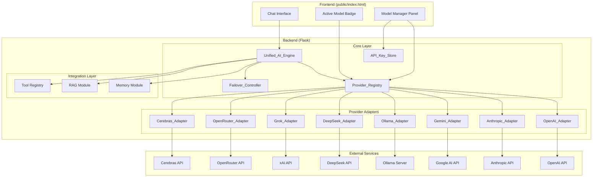
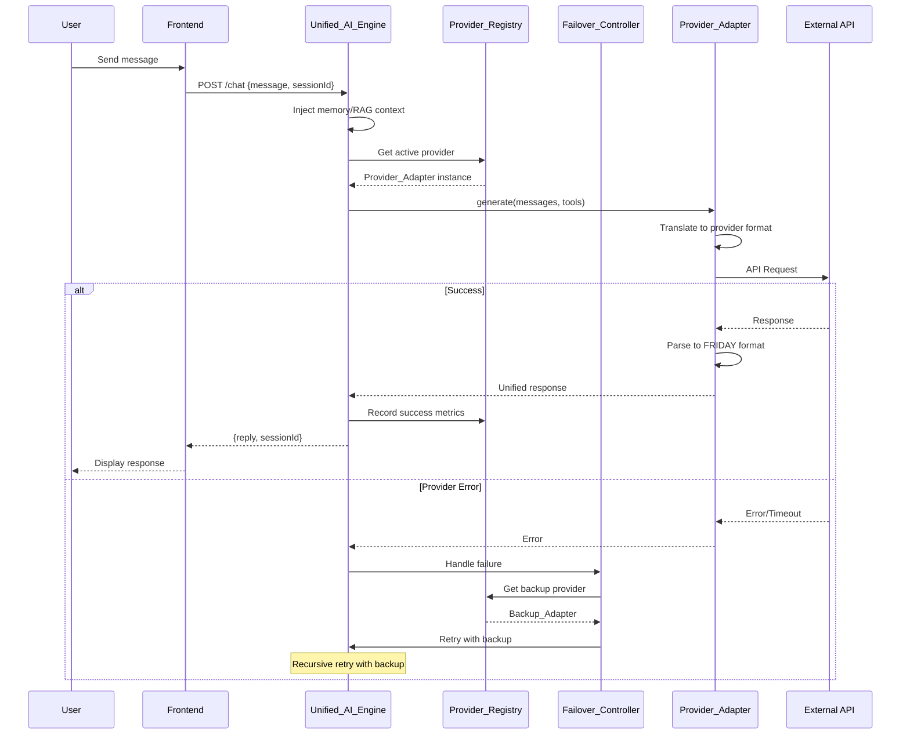

# Technical Design Document: Multi-Provider AI Integration

## Overview

This design document describes the architecture and implementation for integrating multiple AI providers into FRIDAY as first-class capabilities. The system introduces a unified provider abstraction layer that enables seamless switching between OpenAI ChatGPT, Anthropic Claude, Google Gemini, DeepSeek, Grok, Ollama, OpenRouter, and the existing Cerebras provider.

### Goals

1. **Provider Agnosticism**: Enable FRIDAY to communicate with any supported AI provider through a single, consistent interface
2. **Seamless Switching**: Allow users to switch providers without losing conversation context or modifying the UI experience
3. **Resilient Operation**: Implement automatic failover to maintain service availability when providers fail
4. **Secure Configuration**: Store API keys securely on the backend with no frontend exposure
5. **UI Consistency**: Preserve FRIDAY's existing holographic aesthetic while adding provider management capabilities

### Non-Goals

- Fine-tuning or training custom models on any provider
- Provider-specific features that cannot be abstracted (e.g., image generation via provider-specific APIs)
- Multi-tenant provider key management (each FRIDAY instance uses its own keys)

### Key Design Decisions

| Decision | Rationale |
|----------|-----------|
| Adapter Pattern for Providers | Enables adding new providers without modifying core FRIDAY logic; each adapter handles provider-specific API translation |
| Singleton Provider Registry | Ensures consistent provider state across the application; enables health monitoring and status tracking |
| Backend-only API Key Storage | Security requirement - keys never transmitted to frontend; supports both environment variables and encrypted file storage |
| Unified Streaming Format | Normalizes provider-specific streaming formats into common token stream; simplifies frontend integration |
| Tool Definition Translation | Converts FRIDAY's tool definitions to each provider's native format at runtime; maintains tool compatibility |

## Architecture

### System Architecture Diagram



### Request Flow Diagram



## Components and Interfaces

### Provider_Adapter Interface

The `Provider_Adapter` is the core abstraction that all provider implementations must implement. This interface defines the contract for AI provider communication.

```python
from abc import ABC, abstractmethod
from dataclasses import dataclass
from enum import Enum
from typing import Any, Generator, Optional

class ProviderStatus(Enum):
    """Provider operational status."""
    OPERATIONAL = "operational"
    DEGRADED = "degraded"
    UNAVAILABLE = "unavailable"
    NOT_CONFIGURED = "not_configured"

@dataclass
class ProviderCapabilities:
    """Describes what a provider supports."""
    supports_streaming: bool = True
    supports_tool_calling: bool = True
    supports_vision: bool = False
    max_context_window: int = 8192
    supported_models: list[str] = None

@dataclass
class GenerateResponse:
    """Unified response from any provider."""
    content: str
    model: str
    provider: str
    usage: dict[str, int]  # prompt_tokens, completion_tokens, total_tokens
    tool_calls: Optional[list[dict]] = None
    finish_reason: str = "stop"

@dataclass
class ProviderHealth:
    """Health metrics for a provider."""
    status: ProviderStatus
    latency_ms: float
    success_rate: float
    error_rate: float
    last_error: Optional[str] = None
    last_checked: Optional[str] = None


class Provider_Adapter(ABC):
    """Abstract base class for all AI provider adapters.
    
    Each adapter translates FRIDAY's unified message format to the provider's
    native API format and handles response parsing back to FRIDAY format.
    """
    
    @property
    @abstractmethod
    def provider_name(self) -> str:
        """Return the provider identifier (e.g., 'openai', 'anthropic')."""
        pass
    
    @property
    @abstractmethod
    def capabilities(self) -> ProviderCapabilities:
        """Return the provider's capabilities."""
        pass
    
    @abstractmethod
    def is_configured(self) -> bool:
        """Check if the provider has valid configuration (API key, etc.)."""
        pass
    
    @abstractmethod
    def validate_config(self) -> tuple[bool, Optional[str]]:
        """Validate configuration by making a test API call.
        
        Returns:
            Tuple of (is_valid, error_message)
        """
        pass
    
    @abstractmethod
    def generate(
        self,
        messages: list[dict[str, str]],
        model: Optional[str] = None,
        max_tokens: int = 1024,
        temperature: float = 0.7,
        tools: Optional[list[dict]] = None,
    ) -> GenerateResponse:
        """Generate a response from the provider.
        
        Args:
            messages: Chat messages in FRIDAY format
            model: Specific model to use (None for default)
            max_tokens: Maximum tokens in response
            temperature: Sampling temperature
            tools: Tool definitions in FRIDAY format (will be translated)
            
        Returns:
            GenerateResponse with unified response data
            
        Raises:
            ProviderError: On API errors with retry-after info if available
        """
        pass
    
    @abstractmethod
    def stream_generate(
        self,
        messages: list[dict[str, str]],
        model: Optional[str] = None,
        max_tokens: int = 1024,
        temperature: float = 0.7,
    ) -> Generator[str, None, None]:
        """Stream response tokens from the provider.
        
        Args:
            messages: Chat messages in FRIDAY format
            model: Specific model to use
            max_tokens: Maximum tokens in response
            temperature: Sampling temperature
            
        Yields:
            String tokens as they arrive
        """
        pass
    
    @abstractmethod
    def translate_tools(self, friday_tools: list[dict]) -> list[dict]:
        """Translate FRIDAY tool definitions to provider's native format.
        
        Args:
            friday_tools: Tools in OpenAI-compatible format
            
        Returns:
            Tools in provider's native format
        """
        pass
    
    @abstractmethod
    def parse_tool_calls(self, response: Any) -> list[dict]:
        """Parse tool calls from provider response to FRIDAY format.
        
        Args:
            response: Raw provider response
            
        Returns:
            List of tool calls in FRIDAY's ToolCall format
        """
        pass
    
    @abstractmethod
    def get_available_models(self) -> list[dict[str, Any]]:
        """Get list of available models for this provider.
        
        Returns:
            List of model info dicts with name, context_window, etc.
        """
        pass
    
    @abstractmethod
    def get_health(self) -> ProviderHealth:
        """Get current health status and metrics.
        
        Returns:
            ProviderHealth with status and metrics
        """
        pass
```

### Unified_AI_Engine

The `Unified_AI_Engine` is the central component that routes requests to providers and handles cross-cutting concerns like memory injection and failover.

```python
class Unified_AI_Engine:
    """Central engine for AI provider communication.
    
    Provides a consistent interface for sending prompts and receiving responses
    regardless of the underlying provider. Handles:
    - Provider routing via Provider_Registry
    - Memory and RAG context injection
    - Tool definition translation
    - Streaming response normalization
    - Failover coordination
    """
    
    def __init__(
        self,
        registry: "Provider_Registry",
        failover_controller: "Failover_Controller",
        memory_module: Any,
        rag_module: Any,
    ):
        self.registry = registry
        self.failover = failover_controller
        self.memory = memory_module
        self.rag = rag_module
    
    def generate(
        self,
        messages: list[dict[str, str]],
        user_id: str,
        session_id: str,
        model: Optional[str] = None,
        temperature: Optional[float] = None,
        tools: Optional[list[dict]] = None,
    ) -> GenerateResponse:
        """Generate a response with automatic context enrichment.
        
        Injects long-term memory and RAG context, then routes to the
        active provider. On failure, coordinates with Failover_Controller.
        """
        pass
    
    def stream_generate(
        self,
        messages: list[dict[str, str]],
        user_id: str,
        session_id: str,
        model: Optional[str] = None,
        temperature: Optional[float] = None,
    ) -> Generator[str, None, None]:
        """Stream tokens with unified format across all providers."""
        pass
    
    def select_tools(
        self,
        message: str,
        tools: list[dict],
        timeout: float = 3.0,
    ) -> "ToolSelectionResult":
        """Select tools using the active provider."""
        pass
```

### Provider_Registry

```python
class Provider_Registry:
    """Registry and manager for all provider adapters.
    
    Maintains the list of registered providers, tracks their configuration
    and health status, and provides the active provider for requests.
    """
    
    _instance: Optional["Provider_Registry"] = None
    
    def __init__(self):
        self._adapters: dict[str, Provider_Adapter] = {}
        self._active_provider: Optional[str] = None
        self._active_model: Optional[str] = None
        self._metrics: dict[str, ProviderMetrics] = {}
    
    @classmethod
    def get_instance(cls) -> "Provider_Registry":
        """Get singleton instance."""
        pass
    
    def register(self, adapter: Provider_Adapter) -> Optional[str]:
        """Register a provider adapter with validation."""
        pass
    
    def get_adapter(self, provider_name: str) -> Optional[Provider_Adapter]:
        """Get a specific provider adapter."""
        pass
    
    def get_active_adapter(self) -> Optional[Provider_Adapter]:
        """Get the currently active provider adapter."""
        pass
    
    def set_active(self, provider_name: str, model: Optional[str] = None) -> bool:
        """Set the active provider and optionally the model."""
        pass
    
    def get_all_providers(self) -> list[dict[str, Any]]:
        """Get status of all registered providers for Model Manager."""
        pass
    
    def record_request(self, provider: str, success: bool, latency_ms: float, error: Optional[str] = None):
        """Record request metrics for health monitoring."""
        pass
    
    def get_health_metrics(self) -> dict[str, ProviderHealth]:
        """Get health metrics for all providers."""
        pass
    
    def get_degraded_providers(self) -> list[str]:
        """Get list of providers with degraded status."""
        pass
    
    def get_unavailable_providers(self) -> list[str]:
        """Get list of unavailable providers."""
        pass
```

### Failover_Controller

```python
class Failover_Controller:
    """Manages automatic provider failover on errors.
    
    Maintains an ordered list of backup providers and coordinates
    failover when the active provider fails. Attempts to restore
    the primary provider periodically.
    """
    
    def __init__(self, registry: Provider_Registry):
        self.registry = registry
        self._backup_order: list[str] = []
        self._primary_provider: Optional[str] = None
        self._in_failover: bool = False
        self._failover_time: Optional[float] = None
        self._restore_interval: int = 60  # seconds
    
    def set_backup_order(self, providers: list[str]):
        """Set the ordered list of backup providers."""
        pass
    
    def handle_failure(self, failed_provider: str, error: str) -> Optional[Provider_Adapter]:
        """Handle provider failure and return next available backup.
        
        Returns:
            Next available Provider_Adapter, or None if all failed
        """
        pass
    
    def attempt_restore(self) -> bool:
        """Attempt to restore the primary provider.
        
        Called periodically (every 60s) after failover to check if
        primary is available again.
        
        Returns:
            True if primary was restored and user notified
        """
        pass
    
    def get_failover_status(self) -> dict[str, Any]:
        """Get current failover status for UI display."""
        pass
```

### API_Key_Store

```python
class API_Key_Store:
    """Secure storage for provider API keys.
    
    Supports loading keys from environment variables or encrypted
    file storage. Keys are never transmitted to the frontend.
    """
    
    def __init__(self, encryption_key: Optional[str] = None):
        self._keys: dict[str, str] = {}
        self._encryption_key = encryption_key
        self._storage_path: Optional[Path] = None
    
    def load_from_env(self):
        """Load API keys from environment variables.
        
        Expected variables:
        - OPENAI_API_KEY
        - ANTHROPIC_API_KEY
        - GOOGLE_AI_API_KEY
        - DEEPSEEK_API_KEY
        - XAI_API_KEY (Grok)
        - OPENROUTER_API_KEY
        - CEREBRAS_API_KEY (existing)
        - OLLAMA_HOST (not a key, but endpoint)
        """
        pass
    
    def load_from_encrypted_file(self, path: Path) -> bool:
        """Load API keys from encrypted file storage.
        
        Returns:
            True if loaded successfully, False on decryption failure
        """
        pass
    
    def get_key(self, provider: str) -> Optional[str]:
        """Get API key for a provider (backend only)."""
        pass
    
    def set_key(self, provider: str, key: str) -> bool:
        """Set/update an API key (persists to encrypted storage)."""
        pass
    
    def validate_key(self, provider: str, key: str) -> tuple[bool, Optional[str]]:
        """Validate an API key by making a test call.
        
        Returns:
            Tuple of (is_valid, error_message)
        """
        pass
    
    def is_configured(self, provider: str) -> bool:
        """Check if a provider has a configured key."""
        pass
```

## Data Models

### Configuration Models

```python
from dataclasses import dataclass, field
from datetime import datetime
from enum import Enum
from typing import Any, Optional

class ProviderType(Enum):
    """Supported AI provider types."""
    OPENAI = "openai"
    ANTHROPIC = "anthropic"
    GEMINI = "gemini"
    OLLAMA = "ollama"
    DEEPSEEK = "deepseek"
    GROK = "grok"
    OPENROUTER = "openrouter"
    CEREBRAS = "cerebras"


@dataclass
class ProviderConfig:
    """Configuration for a provider."""
    provider_type: ProviderType
    api_key_env: str  # Environment variable name
    base_url: Optional[str] = None  # For Ollama or custom endpoints
    default_model: Optional[str] = None
    enabled: bool = True
    
    # Provider-specific settings
    extra_settings: dict[str, Any] = field(default_factory=dict)


@dataclass
class ModelInfo:
    """Information about an available model."""
    id: str
    name: str
    provider: ProviderType
    context_window: int
    supports_streaming: bool = True
    supports_tool_calling: bool = True
    supports_vision: bool = False
    input_cost_per_1k: Optional[float] = None  # USD per 1000 tokens
    output_cost_per_1k: Optional[float] = None


@dataclass
class ProviderMetrics:
    """Metrics tracked for provider health monitoring."""
    total_requests: int = 0
    successful_requests: int = 0
    failed_requests: int = 0
    total_latency_ms: float = 0.0
    last_error: Optional[str] = None
    last_error_time: Optional[datetime] = None
    consecutive_failures: int = 0
    
    @property
    def success_rate(self) -> float:
        if self.total_requests == 0:
            return 1.0
        return self.successful_requests / self.total_requests
    
    @property
    def error_rate(self) -> float:
        if self.total_requests == 0:
            return 0.0
        return self.failed_requests / self.total_requests
    
    @property
    def average_latency_ms(self) -> float:
        if self.successful_requests == 0:
            return 0.0
        return self.total_latency_ms / self.successful_requests


@dataclass 
class ActiveProviderState:
    """Current active provider state for badge display."""
    provider: ProviderType
    model: str
    status: ProviderStatus
    latency_ms: Optional[float] = None
    in_failover: bool = False
    failover_from: Optional[str] = None
```

### Message and Response Models

```python
@dataclass
class FridayMessage:
    """Internal message format used by FRIDAY."""
    role: str  # "system", "user", "assistant", "tool"
    content: str
    name: Optional[str] = None  # For tool messages
    tool_call_id: Optional[str] = None
    provider: Optional[str] = None  # Which provider generated this
    model: Optional[str] = None  # Which model generated this
    timestamp: Optional[str] = None


@dataclass
class ConversationContext:
    """Context injected into conversations."""
    user_id: str
    session_id: str
    long_term_memory: Optional[str] = None
    rag_context: Optional[str] = None
    conversation_history: list[FridayMessage] = field(default_factory=list)


@dataclass
class StreamChunk:
    """A chunk from streaming response."""
    content: str
    is_final: bool = False
    tool_call_delta: Optional[dict] = None


@dataclass
class ToolCallRequest:
    """Tool call parsed from provider response."""
    id: str
    function_name: str
    arguments: dict[str, Any]
    provider_format: str  # Original provider format for debugging


@dataclass
class ProviderError:
    """Error from a provider with retry info."""
    provider: str
    error_type: str  # "rate_limit", "auth", "server", "timeout", "connection"
    message: str
    retry_after: Optional[int] = None  # Seconds to wait before retry
    is_retryable: bool = True
```

### API Response Models

```python
@dataclass
class ModelManagerResponse:
    """Response for Model Manager UI."""
    providers: list[dict[str, Any]]  # Provider list with status
    active_provider: str
    active_model: str
    session_usage: dict[str, int]  # Token usage for current session
    

@dataclass
class ActiveBadgeResponse:
    """Response for Active Model Badge updates."""
    provider: str
    model: str
    status: str  # "operational", "degraded", "unavailable"
    status_color: str  # "green", "yellow", "red"
    in_failover: bool
    failover_message: Optional[str] = None


@dataclass
class HealthResponse:
    """Extended health response with provider metrics."""
    status: str
    version: str
    providers: dict[str, ProviderHealth]
    active_provider: str
    tool_calling_available: bool
```

### Database Schema Extensions

```sql
-- Provider configuration (encrypted API keys stored separately)
CREATE TABLE IF NOT EXISTS provider_configs (
    id INTEGER PRIMARY KEY AUTOINCREMENT,
    provider_type TEXT NOT NULL UNIQUE,
    enabled INTEGER DEFAULT 1,
    default_model TEXT,
    base_url TEXT,
    extra_settings TEXT,  -- JSON
    created_at TEXT NOT NULL,
    updated_at TEXT NOT NULL
);

-- Provider metrics for health monitoring
CREATE TABLE IF NOT EXISTS provider_metrics (
    id INTEGER PRIMARY KEY AUTOINCREMENT,
    provider_type TEXT NOT NULL,
    total_requests INTEGER DEFAULT 0,
    successful_requests INTEGER DEFAULT 0,
    failed_requests INTEGER DEFAULT 0,
    total_latency_ms REAL DEFAULT 0,
    recorded_at TEXT NOT NULL,
    FOREIGN KEY (provider_type) REFERENCES provider_configs(provider_type)
);

-- Conversation message extended with provider info
-- (extends existing conversations table)
ALTER TABLE conversations ADD COLUMN provider TEXT;
ALTER TABLE conversations ADD COLUMN model TEXT;

-- User provider preferences
CREATE TABLE IF NOT EXISTS user_provider_prefs (
    user_id TEXT PRIMARY KEY,
    active_provider TEXT,
    active_model TEXT,
    backup_order TEXT,  -- JSON array
    updated_at TEXT NOT NULL
);
```


## Correctness Properties

*A property is a characteristic or behavior that should hold true across all valid executions of a system—essentially, a formal statement about what the system should do. Properties serve as the bridge between human-readable specifications and machine-verifiable correctness guarantees.*

### Property 1: Unified Response Format Consistency

*For any* valid message sent through the Unified_AI_Engine and *for any* configured provider, the response SHALL contain all required fields (content, model, provider, usage) in the unified GenerateResponse format.

**Validates: Requirements 1.1**

### Property 2: Provider Registration Tracking

*For any* valid Provider_Adapter registration, the Provider_Registry SHALL contain that adapter with its correct configuration and ProviderStatus accessible via get_adapter().

**Validates: Requirements 1.3**

### Property 3: Interface Validation on Registration

*For any* Provider_Adapter implementation, registration in Provider_Registry SHALL succeed if and only if all required interface methods (generate, stream_generate, translate_tools, parse_tool_calls, get_available_models, get_health, is_configured, validate_config) are implemented.

**Validates: Requirements 1.4**

### Property 4: Message Format Translation

*For any* valid FRIDAY message format (with role, content, and optional metadata) and *for any* provider type, the adapter's message translation SHALL produce a valid message in that provider's native API format.

**Validates: Requirements 2.3, 3.3, 4.3, 5.3**

### Property 5: Tool Definition Translation

*For any* valid FRIDAY tool definition (in OpenAI-compatible format with name, description, parameters) and *for any* provider that supports tool calling, the translate_tools() method SHALL produce a valid tool definition in that provider's native format.

**Validates: Requirements 2.5, 3.5, 4.5, 12.1**

### Property 6: Tool Call Parsing

*For any* valid tool call response from *any* provider, parse_tool_calls() SHALL produce a list of FRIDAY ToolCall objects with correctly extracted id, function_name, and arguments.

**Validates: Requirements 12.2**

### Property 7: Model Name Abbreviation

*For any* full model name string, the abbreviation function SHALL produce a display name of 12 characters or fewer while preserving the model family identifier.

**Validates: Requirements 8.2**

### Property 8: Status Color Mapping

*For any* ProviderStatus value, the status-to-color mapping SHALL return exactly one of: "green" for OPERATIONAL, "yellow" for DEGRADED, "red" for UNAVAILABLE, "gray" for NOT_CONFIGURED.

**Validates: Requirements 8.3**

### Property 9: Backup Order Maintenance

*For any* backup provider list set via set_backup_order(), the Failover_Controller SHALL maintain that exact ordered sequence retrievable via get_backup_order().

**Validates: Requirements 9.1**

### Property 10: Failover on Provider Error

*For any* error returned by the active provider and *for any* non-empty backup list, the Failover_Controller SHALL select the first available backup provider and retry the request.

**Validates: Requirements 9.2**

### Property 11: Active Provider State After Failover

*For any* successful failover event, get_active_adapter() SHALL return the backup provider that handled the request, and get_failover_status() SHALL indicate in_failover=True.

**Validates: Requirements 9.3**

### Property 12: Primary Restore Notification Without Auto-Switch

*For any* restore event where the primary provider becomes available during failover, the system SHALL emit a notification but the active provider SHALL remain unchanged (still the backup).

**Validates: Requirements 9.6**

### Property 13: Environment Variable Key Loading

*For any* environment variable following the naming pattern {PROVIDER}_API_KEY with a non-empty value, load_from_env() SHALL make that key available via get_key(provider).

**Validates: Requirements 10.2**

### Property 14: Encrypted Storage Round-Trip

*For any* API key stored via set_key() to encrypted storage, load_from_encrypted_file() followed by get_key() SHALL return the identical key value.

**Validates: Requirements 10.3**

### Property 15: Streaming Format Normalization

*For any* provider's native streaming response format, stream_generate() SHALL yield plain string tokens without provider-specific metadata or wrapper objects.

**Validates: Requirements 11.1**

### Property 16: Markdown Preservation in Streaming

*For any* markdown-formatted content yielded through streaming, the concatenation of all yielded tokens SHALL preserve the original markdown structure (headers, lists, code blocks, emphasis).

**Validates: Requirements 11.4**

### Property 17: Context Injection

*For any* available context (long-term memory or RAG documents) and *for any* provider, the context SHALL be present in the messages array sent to the provider's generate() method.

**Validates: Requirements 13.1, 13.2**

### Property 18: Context Window Limit Enforcement

*For any* provider with a defined context_window limit and *for any* combination of messages, memory context, and RAG context, the total token count of the injected context SHALL NOT exceed the provider's context_window.

**Validates: Requirements 13.4**

### Property 19: Conversation History Preservation Across Provider Switches

*For any* active conversation and *for any* sequence of provider switches, the complete conversation history SHALL remain intact and accessible via get_history().

**Validates: Requirements 13.3**

### Property 20: History Inclusion on Provider Switch

*For any* provider switch during an active conversation, the next generate() call SHALL include relevant conversation history in the messages array.

**Validates: Requirements 14.2**

### Property 21: Message Provider Metadata

*For any* assistant message stored in conversation history, the message SHALL include non-null provider and model fields indicating which provider/model generated it.

**Validates: Requirements 14.3, 14.4**

### Property 22: Request Latency Tracking

*For any* completed request to *any* provider, record_request() SHALL update the provider's metrics with the measured latency_ms value, and get_health() SHALL return the updated average_latency_ms.

**Validates: Requirements 16.1**

### Property 23: Success and Error Rate Calculation

*For any* sequence of N requests to a provider with S successes and F failures (where S + F = N), the provider's success_rate SHALL equal S/N and error_rate SHALL equal F/N.

**Validates: Requirements 16.2**

### Property 24: Degraded Status Threshold

*For any* provider with 10 or more recorded requests where error_rate exceeds 0.5, the provider's status SHALL be DEGRADED.

**Validates: Requirements 16.4**

### Property 25: Unavailable Status Threshold

*For any* provider with 5 consecutive failed requests (consecutive_failures >= 5), the provider's status SHALL be UNAVAILABLE.

**Validates: Requirements 16.5**

### Property 26: Provider Selection State Update

*For any* valid provider/model selection via set_active(), the active provider and model SHALL be updated and subsequent get_active_adapter() calls SHALL return the newly selected adapter.

**Validates: Requirements 7.2**

### Property 27: Latency Data Availability

*For any* provider with at least one successful recorded request, get_health() SHALL return a ProviderHealth object with latency_ms > 0.

**Validates: Requirements 7.5**

### Property 28: Session Token Usage Tracking

*For any* session with at least one completed request, the session's token usage (prompt_tokens, completion_tokens, total_tokens) SHALL accurately reflect the sum of all request usages.

**Validates: Requirements 7.6**

### Property 29: Context Window Information

*For any* model returned by get_available_models(), the model info SHALL include a context_window field with a positive integer value.

**Validates: Requirements 7.7**

### Property 30: Ollama Tool Capability Check

*For any* Ollama model, tool calling via translate_tools() SHALL only proceed if the model's capabilities indicate supports_tool_calling=True; otherwise, prompt-based fallback SHALL be used.

**Validates: Requirements 12.5**

## Error Handling

### Provider Error Categories

| Error Type | HTTP Status | Retryable | Failover Trigger | User Message |
|------------|-------------|-----------|------------------|--------------|
| Rate Limit | 429 | Yes (after delay) | No | "Rate limited. Trying again in {retry_after}s..." |
| Authentication | 401, 403 | No | No | "API key invalid. Please check your {provider} configuration." |
| Server Error | 500-599 | Yes | Yes | "Provider temporarily unavailable. Switching to backup..." |
| Timeout | N/A | Yes | Yes | "Request timed out. Trying backup provider..." |
| Connection | N/A | Yes | Yes | "Connection failed. Switching to backup..." |
| Model Not Found | 404 | No | No | "Model not available. Please select a different model." |
| Context Too Long | 400 | No | No | "Message too long for this model. Consider a model with larger context window." |

### Error Handling Flow

```mermaid
flowchart TD
    A[Request to Provider] --> B{Success?}
    B -->|Yes| C[Return Response]
    B -->|No| D{Error Type}
    
    D -->|Rate Limit| E[Extract retry_after]
    E --> F{retry_after < 30s?}
    F -->|Yes| G[Wait and Retry]
    F -->|No| H[Return Error to User]
    
    D -->|Auth Error| H
    D -->|Model Not Found| H
    D -->|Context Too Long| H
    
    D -->|Server/Timeout/Connection| I[Trigger Failover]
    I --> J{Backup Available?}
    J -->|Yes| K[Switch to Backup]
    K --> L[Retry Request]
    L --> B
    J -->|No| M[All Providers Failed]
    M --> N[Return "All providers unavailable" Error]
    
    G --> B
```

### Error Response Format

```python
@dataclass
class ErrorResponse:
    """Standardized error response for frontend."""
    error: str  # Error type identifier
    message: str  # User-friendly message
    provider: str  # Which provider failed
    retryable: bool
    retry_after: Optional[int] = None  # Seconds
    failover_active: bool = False
    failover_provider: Optional[str] = None
```

### Provider-Specific Error Mapping

Each adapter implements error mapping from provider-specific errors to the unified error format:

```python
class OpenAI_Adapter(Provider_Adapter):
    def _map_error(self, e: Exception) -> ProviderError:
        if isinstance(e, openai.RateLimitError):
            return ProviderError(
                provider="openai",
                error_type="rate_limit",
                message="OpenAI rate limit exceeded",
                retry_after=int(e.response.headers.get("retry-after", 60)),
                is_retryable=True,
            )
        elif isinstance(e, openai.AuthenticationError):
            return ProviderError(
                provider="openai",
                error_type="auth",
                message="Invalid OpenAI API key",
                is_retryable=False,
            )
        # ... additional mappings
```

## Testing Strategy

### Testing Approach

This feature requires a dual testing approach combining unit tests for specific behaviors and property-based tests for universal correctness guarantees.

**Unit Tests**: Cover specific examples, edge cases, error conditions, and integration points. Focus on:
- Individual adapter implementations with mocked APIs
- Error handling scenarios
- Edge cases (empty inputs, malformed responses)
- Integration with memory/RAG modules

**Property-Based Tests**: Verify universal properties hold across all valid inputs. Use the Hypothesis library for Python property-based testing.

### Property-Based Testing Configuration

- **Library**: Hypothesis (Python)
- **Minimum iterations**: 100 per property test
- **Tagging format**: Each test includes a comment referencing the design property

```python
from hypothesis import given, settings, strategies as st

@settings(max_examples=100)
@given(message=st.text(min_size=1, max_size=1000))
def test_message_format_translation_openai(message):
    """
    Feature: multi-provider-ai, Property 4: Message Format Translation
    For any valid FRIDAY message, OpenAI translation produces valid format.
    """
    friday_message = {"role": "user", "content": message}
    adapter = OpenAI_Adapter()
    translated = adapter._translate_message(friday_message)
    
    assert "role" in translated
    assert "content" in translated
    assert translated["role"] in ["system", "user", "assistant", "tool"]
```

### Test Categories

#### 1. Provider Adapter Unit Tests

Each adapter requires tests for:
- Configuration validation
- Message format translation
- Tool definition translation
- Tool call response parsing
- Streaming response handling
- Error mapping

```python
# Example: OpenAI Adapter Tests
class TestOpenAIAdapter:
    def test_is_configured_with_valid_key(self):
        """Verify adapter reports configured when API key is set."""
        pass
    
    def test_translate_message_user_role(self):
        """Verify user message translation to OpenAI format."""
        pass
    
    def test_translate_tools_to_openai_format(self):
        """Verify FRIDAY tools become OpenAI function format."""
        pass
    
    def test_parse_tool_calls_from_response(self):
        """Verify tool calls are correctly parsed."""
        pass
    
    def test_stream_generate_yields_tokens(self):
        """Verify streaming yields individual tokens."""
        pass
    
    def test_rate_limit_error_mapping(self):
        """Verify rate limit errors include retry-after."""
        pass
```

#### 2. Provider Registry Tests

```python
class TestProviderRegistry:
    def test_register_valid_adapter(self):
        """Verify valid adapter registration succeeds."""
        pass
    
    def test_register_incomplete_adapter_fails(self):
        """Verify adapter missing methods fails registration."""
        pass
    
    def test_get_all_providers_returns_all(self):
        """Verify all registered providers are returned."""
        pass
    
    def test_set_active_updates_state(self):
        """Verify setting active provider updates state correctly."""
        pass
    
    def test_health_metrics_updated_on_request(self):
        """Verify metrics are updated after each request."""
        pass
    
    def test_degraded_status_at_threshold(self):
        """Verify provider marked degraded at >50% error rate."""
        pass
    
    def test_unavailable_after_consecutive_failures(self):
        """Verify provider marked unavailable after 5 failures."""
        pass
```

#### 3. Failover Controller Tests

```python
class TestFailoverController:
    def test_backup_order_maintained(self):
        """Verify backup order is preserved."""
        pass
    
    def test_failover_selects_first_backup(self):
        """Verify failover uses first available backup."""
        pass
    
    def test_failover_skips_unavailable_backup(self):
        """Verify unavailable backups are skipped."""
        pass
    
    def test_all_providers_failed_returns_error(self):
        """Verify correct error when all providers fail."""
        pass
    
    def test_restore_notification_no_auto_switch(self):
        """Verify restore notifies but doesn't switch."""
        pass
```

#### 4. Unified AI Engine Tests

```python
class TestUnifiedAIEngine:
    def test_memory_context_injected(self):
        """Verify long-term memory is injected into prompts."""
        pass
    
    def test_rag_context_injected(self):
        """Verify RAG context is injected into prompts."""
        pass
    
    def test_context_window_limit_respected(self):
        """Verify context doesn't exceed model's limit."""
        pass
    
    def test_conversation_history_preserved_on_switch(self):
        """Verify history survives provider switch."""
        pass
    
    def test_message_tagged_with_provider(self):
        """Verify assistant messages have provider metadata."""
        pass
    
    def test_streaming_normalizes_format(self):
        """Verify streaming output is plain tokens."""
        pass
```

#### 5. API Key Store Tests

```python
class TestAPIKeyStore:
    def test_load_from_env_variables(self):
        """Verify keys loaded from environment."""
        pass
    
    def test_encrypted_storage_round_trip(self):
        """Verify key survives encrypt/decrypt cycle."""
        pass
    
    def test_decryption_failure_marks_not_configured(self):
        """Verify failed decryption sets NOT_CONFIGURED."""
        pass
    
    def test_key_validation_makes_test_call(self):
        """Verify validation makes API test call."""
        pass
```

#### 6. Property-Based Tests

```python
# Property 1: Unified Response Format
@settings(max_examples=100)
@given(content=st.text(min_size=1), provider=st.sampled_from(["openai", "anthropic", "gemini"]))
def test_response_format_consistency(content, provider):
    """Feature: multi-provider-ai, Property 1: Unified Response Format"""
    pass

# Property 4: Message Format Translation
@settings(max_examples=100)
@given(
    role=st.sampled_from(["system", "user", "assistant"]),
    content=st.text(min_size=1, max_size=5000),
    provider=st.sampled_from(["openai", "anthropic", "gemini", "ollama"]),
)
def test_message_translation_all_providers(role, content, provider):
    """Feature: multi-provider-ai, Property 4: Message Format Translation"""
    pass

# Property 5: Tool Definition Translation
@settings(max_examples=100)
@given(
    tool_name=st.text(min_size=1, max_size=64, alphabet=st.characters(whitelist_categories=("L", "N", "_"))),
    description=st.text(min_size=1, max_size=1024),
    provider=st.sampled_from(["openai", "anthropic", "gemini"]),
)
def test_tool_translation_all_providers(tool_name, description, provider):
    """Feature: multi-provider-ai, Property 5: Tool Definition Translation"""
    pass

# Property 23: Success/Error Rate Calculation
@settings(max_examples=100)
@given(
    successes=st.integers(min_value=0, max_value=100),
    failures=st.integers(min_value=0, max_value=100),
)
def test_rate_calculation_accuracy(successes, failures):
    """Feature: multi-provider-ai, Property 23: Success and Error Rate Calculation"""
    pass

# Property 24: Degraded Status Threshold
@settings(max_examples=100)
@given(
    total_requests=st.integers(min_value=10, max_value=100),
    error_fraction=st.floats(min_value=0.0, max_value=1.0),
)
def test_degraded_status_threshold(total_requests, error_fraction):
    """Feature: multi-provider-ai, Property 24: Degraded Status Threshold"""
    pass
```

### Integration Tests

Integration tests verify end-to-end behavior with real (or sandboxed) provider APIs:

```python
class TestProviderIntegration:
    """Integration tests requiring API keys (run in CI with secrets)."""
    
    @pytest.mark.integration
    def test_openai_generate_returns_response(self):
        """Verify OpenAI adapter produces valid response."""
        pass
    
    @pytest.mark.integration
    def test_anthropic_streaming_yields_tokens(self):
        """Verify Anthropic streaming works end-to-end."""
        pass
    
    @pytest.mark.integration
    def test_ollama_local_connection(self):
        """Verify Ollama connects to local server."""
        pass
    
    @pytest.mark.integration
    def test_failover_e2e(self):
        """Verify failover works with real providers."""
        pass
```

### Test Coverage Targets

| Component | Unit Test Coverage | Property Test Coverage |
|-----------|-------------------|----------------------|
| Provider Adapters | 90% | Properties 4, 5, 6 |
| Provider Registry | 85% | Properties 2, 3, 22-25 |
| Failover Controller | 90% | Properties 9-12 |
| Unified AI Engine | 85% | Properties 1, 15-21, 26-30 |
| API Key Store | 90% | Properties 13, 14 |
| Status/Color Mapping | 100% | Properties 7, 8 |

