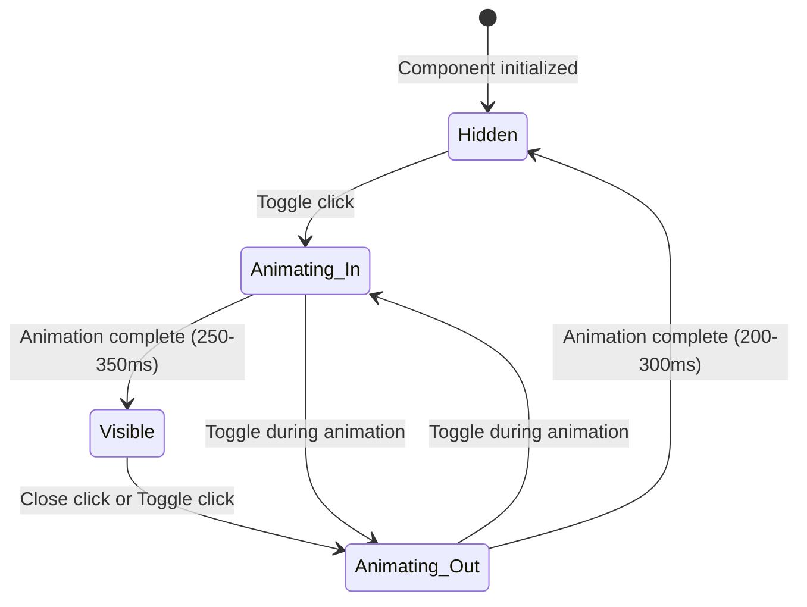

# Design Document: Music Player Redesign

## Overview

This design transforms the FRIDAY music player from its current full-width, bottom-fixed panel into a compact floating "liquid glass" overlay. The redesigned player uses glassmorphism (frosted glass with backdrop blur, semi-transparent backgrounds, soft borders and shadows) to feel modern and integrated within the FRIDAY HUD aesthetic. The panel is independently togglable, non-blocking to the chat interface, responsive across viewport sizes, and animated with smooth scale/opacity transitions.

### Design Rationale

The current music player spans the entire viewport width at the bottom, which blocks chat interaction and feels heavy on mobile. The redesign makes the player a small overlay that users can summon on demand, preserving all existing functionality (search, playback controls, progress, album art) in a more compact form factor.

### Key Changes from Current Implementation

| Aspect | Current | Redesigned |
|--------|---------|-----------|
| Position | Full-width bottom-fixed bar | Floating overlay, bottom-right |
| Max Width | 100% viewport | 340px (desktop), full - 32px (mobile) |
| Toggle | Hidden/shown via class toggle | Dedicated persistent toggle button |
| Animation | translateY slide | scale + opacity with easing |
| Visual Style | Solid dark background | Glassmorphism (blur, transparency, borders) |
| Mini Indicator | Small badge bottom-right | Toggle button with pulse animation |

## Architecture

```mermaid
graph TD
    subgraph "Frontend (public/index.html)"
        TB[Toggle Button] -->|click| PM[Panel Manager]
        PM -->|show/hide| MP[Music Panel DOM]
        MP --> AC[Album/Controls Section]
        MP --> PB[Progress Bar Section]
        MP --> SI[Search Input Section]
        SI -->|debounce 250ms| API[/music/autocomplete]
        SI -->|Enter key| SAPI[/music/search]
        AC --> YT[YouTube IFrame Player]
    end

    subgraph "Backend (unchanged)"
        API --> SE[SearchEngine]
        SAPI --> SE
        SE --> YTA[YouTube API]
        SE --> JSA[JioSaavn API]
    end
```

The architecture remains client-side for the UI redesign. The `MusicPlayer` class is refactored to support the new DOM structure and animation states, while the backend `/music/search` and `/music/autocomplete` endpoints remain unchanged.

### State Machine



## Components and Interfaces

### 1. Toggle Button Component

A persistent button always visible after initialization. Positioned at the bottom-right to open/close the music panel.

```javascript
class MusicToggleButton {
  constructor(panelManager) { }

  // Renders the toggle button into the DOM
  render() { }

  // Updates visual state: idle, playing (pulsing), or disabled (during animation)
  setState(state: 'idle' | 'playing' | 'disabled') { }

  // Click handler — delegates to PanelManager
  _onClick() { }
}
```

### 2. Panel Manager (Animation Controller)

Manages panel visibility state and animation transitions. Prevents conflicting state changes during animation.

```javascript
class PanelManager {
  constructor(panelElement, toggleButton) { }

  // Current state: 'hidden' | 'animating_in' | 'visible' | 'animating_out'
  get state() { }

  // Trigger show animation
  show() { }

  // Trigger hide animation
  hide() { }

  // Toggle visibility (handles mid-animation reversal)
  toggle() { }

  // Cancel current animation and reverse from intermediate state
  _reverseAnimation() { }

  // Apply glassmorphism fallback if backdrop-filter unsupported
  _applyFallbackStyles() { }
}
```

### 3. Redesigned MusicPlayer Class

Extends the existing `MusicPlayer` with the new DOM structure and compact layout.

```javascript
class MusicPlayer {
  constructor() { }

  // Existing methods (unchanged behavior)
  loadTrack(track) { }
  loadQueue(tracks, startIndex) { }
  play() { }
  pause() { }
  togglePlayPause() { }
  next() { }
  previous() { }

  // Updated formatting — supports h:mm:ss for tracks >= 60min
  formatTime(seconds) { }

  // Updated progress tracking
  startProgressInterval() { }
  stopProgressInterval() { }

  // Search with debounce and validation
  initSearch() { }
  search(query) { }
  displayResults(results) { }
  displaySuggestions(suggestions) { }

  // New: validate search input (max 200 chars)
  validateSearchInput(query) { }

  // New: clear suggestions when input < 2 chars
  clearSuggestions() { }
}
```

### 4. CSS Architecture

The glassmorphism styles are layered:

```css
.music-panel {
  /* Base layer */
  background: rgba(10, 22, 40, 0.25);

  /* Frosted glass */
  backdrop-filter: blur(20px);
  -webkit-backdrop-filter: blur(20px);

  /* Border definition */
  border: 1px solid rgba(0, 229, 255, 0.15);

  /* Depth shadow */
  box-shadow: 0 8px 20px rgba(0, 0, 0, 0.25);

  /* Rounded corners */
  border-radius: 16px;

  /* Sizing constraints */
  max-width: 340px;
  max-height: 50vh;
  overflow-y: auto;

  /* Positioning */
  position: fixed;
  bottom: 16px;
  right: 16px;
  z-index: 150;
}

/* Fallback for browsers without backdrop-filter */
@supports not (backdrop-filter: blur(1px)) {
  .music-panel {
    background: rgba(10, 22, 40, 0.8);
  }
}

/* Responsive: mobile */
@media (max-width: 500px) {
  .music-panel {
    max-width: none;
    width: calc(100vw - 32px);
    left: 16px;
    right: 16px;
  }
}
```

## Data Models

### Panel State

```typescript
interface PanelState {
  visibility: 'hidden' | 'animating_in' | 'visible' | 'animating_out';
  isPlaying: boolean;
  currentTrack: Track | null;
  searchQuery: string;
  suggestions: Suggestion[];
  searchResults: Track[];
  error: string | null;
}
```

### Track (unchanged from existing)

```typescript
interface Track {
  video_id: string;
  title: string;
  artist: string;
  thumbnail_url: string;
  source: string;
  source_url?: string;
  duration_seconds?: number;
  is_devotional?: boolean;
  tradition?: string;
  match_score?: number;
}
```

### Suggestion (from autocomplete endpoint)

```typescript
interface Suggestion {
  title: string;
  artist: string;
  thumbnail_url: string;
  video_id: string;
  source: string;
}
```

### Responsive Breakpoints

| Viewport Width | Panel Behavior |
|---|---|
| <= 500px | Full width minus 32px (16px margin each side) |
| > 500px | Max 340px width, fixed bottom-right |

### Animation Parameters

| Transition | Duration | Easing | Start State | End State |
|---|---|---|---|---|
| Show | 300ms | ease-out | scale(0.95) opacity(0) | scale(1) opacity(1) |
| Hide | 250ms | ease-in | scale(1) opacity(1) | scale(0.95) opacity(0) |

## Correctness Properties

*A property is a characteristic or behavior that should hold true across all valid executions of a system — essentially, a formal statement about what the system should do. Properties serve as the bridge between human-readable specifications and machine-verifiable correctness guarantees.*

### Property 1: Responsive Panel Sizing

*For any* viewport dimension (width, height), the Music Panel's computed dimensions SHALL satisfy: if viewport width <= 500px then panel width === viewport width - 32px, if viewport width > 500px then panel width <= 340px, and panel height <= min(320px, viewport height * 0.5). Additionally, the panel SHALL maintain a minimum margin of 16px from the right and bottom viewport edges.

**Validates: Requirements 1.1, 1.2, 1.5, 6.1, 6.2, 6.3**

### Property 2: Progress Bar Proportionality

*For any* current playback time `t` and total track duration `d` where d > 0, the progress bar filled width percentage SHALL equal `(t / d) * 100`, with a tolerance of ±1%.

**Validates: Requirements 4.4**

### Property 3: Time Formatting

*For any* non-negative number of seconds `s`, the formatTime function SHALL return a string matching the pattern `m:ss` when s < 3600, or `h:mm:ss` when s >= 3600, where the minutes and seconds components are zero-padded to two digits.

**Validates: Requirements 4.5**

### Property 4: Search Input Validation

*For any* string input to the Search_Input, if the string length exceeds 200 characters the input SHALL be rejected (truncated or prevented), and if the string length drops below 2 characters all displayed suggestions SHALL be hidden and cleared.

**Validates: Requirements 5.1, 5.7**

### Property 5: Autocomplete Suggestions Cap

*For any* autocomplete response containing N suggestions where N > 8, the Music Panel SHALL display at most 8 suggestion items in the dropdown.

**Validates: Requirements 5.2**

### Property 6: Search Results Cap

*For any* search response containing N results where N > 20, the Music Panel SHALL render at most 20 result items in the scrollable results list.

**Validates: Requirements 5.4**

### Property 7: Text Truncation

*For any* track title or artist string that exceeds the available container width, the rendered text element SHALL apply single-line truncation with ellipsis (text-overflow: ellipsis, overflow: hidden, white-space: nowrap), and the element's rendered width SHALL not exceed its parent container width.

**Validates: Requirements 4.2**

### Property 8: Contrast Accessibility

*For any* text or icon element within the Music Panel, the contrast ratio between the element's color and the panel background SHALL be at least 4.5:1.

**Validates: Requirements 3.7**

## Error Handling

### Search Errors

| Scenario | Behavior |
|---|---|
| Network timeout (>5s) | Display "Search temporarily unavailable" in search area |
| Network error (offline) | Show offline banner with retry button; auto-retry up to 3 times with 5s intervals |
| Empty results | Display "No results found" message |
| API returns 400 | Display error message from response |
| API returns 503 | Display "All music sources unavailable" |

### Playback Errors

| Scenario | Behavior |
|---|---|
| YouTube video unavailable | Show toast "Track unavailable, skipping...", auto-advance to next |
| YouTube API fails to load (10s timeout) | Mark `ytApiLoaded = false`, open YouTube in new tab on play attempt |

### Animation Edge Cases

| Scenario | Behavior |
|---|---|
| Toggle during animation | Cancel current animation, reverse from intermediate state |
| Rapid multiple clicks | Ignore clicks while transition is in progress (debounce via state check) |
| CSS transitions unsupported | Immediate show/hide without animation (graceful degradation) |

### Backdrop-Filter Fallback

If `backdrop-filter` is unsupported (detected via `CSS.supports` or `@supports`), the panel falls back to a solid semi-transparent background (opacity 0.7-0.85) to maintain visibility without the blur effect.

## Testing Strategy

### Unit Tests (Example-Based)

Focus on specific scenarios, edge cases, and DOM structure verification:

- Toggle button visibility after initialization (Req 2.6)
- Animation timing within specified bounds (Req 2.2, 2.3, 7.1, 7.2)
- Pointer-events disabled when panel hidden (Req 7.3)
- Z-index ordering: panel > chat, panel < modals (Req 1.4)
- Chat remains interactive when panel visible (Req 1.3)
- Glassmorphism CSS values within specified ranges (Req 3.1-3.5)
- Backdrop-filter fallback behavior (Req 3.6)
- Animation interruption and reversal (Req 7.4)
- Click debounce during animation (Req 2.5)
- Playback indicator on toggle button when playing + hidden (Req 2.4)
- Album art dimensions <= 48x48px (Req 4.1)
- Playback controls exist (prev, play/pause, next) (Req 4.3)
- Search error states (timeout, empty results) (Req 5.5, 5.6)
- Track selection initiates playback with loading indicator (Req 5.3)
- Vertical scrolling when content exceeds max-height (Req 6.4)

### Property-Based Tests

Using a JavaScript property-based testing library (e.g., `fast-check`), minimum 100 iterations per property:

- **Feature: music-player-redesign, Property 1**: Responsive panel sizing across random viewport dimensions
- **Feature: music-player-redesign, Property 2**: Progress bar width proportional to time/duration ratio
- **Feature: music-player-redesign, Property 3**: Time formatting for random second values
- **Feature: music-player-redesign, Property 4**: Search input validation for random strings
- **Feature: music-player-redesign, Property 5**: Autocomplete suggestions capped at 8
- **Feature: music-player-redesign, Property 6**: Search results capped at 20
- **Feature: music-player-redesign, Property 7**: Text truncation for random-length strings
- **Feature: music-player-redesign, Property 8**: Contrast accessibility for all panel text elements

### Integration Tests

- Full flow: type query → see suggestions → select → playback starts
- Panel toggle → animation → visible → interact → close → animation → hidden
- Responsive behavior when resizing browser window across breakpoints

### Testing Tools

- **Property-based testing**: `fast-check` (JavaScript PBT library)
- **DOM testing**: `jsdom` or browser-based test runner
- **Unit testing**: `vitest` or `jest` (whichever is configured in the project)
- **Accessibility**: `axe-core` for contrast ratio validation
