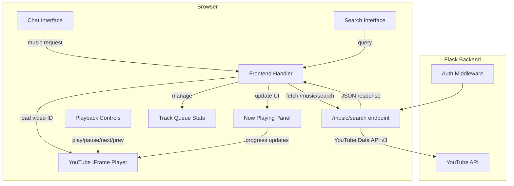

# Design Document: Music Player

## Overview

This design adds an embedded music player to the Friday AI Assistant, replacing the current behavior of opening YouTube search URLs in new tabs. The player uses the YouTube IFrame Player API for in-browser audio/video playback and presents an Apple Music-inspired "Now Playing" UI with playback controls, search, and queue management.

The implementation spans two layers:
- **Backend**: A new `/music/search` Flask endpoint that queries YouTube and returns structured track metadata (video IDs, titles, artists, thumbnails).
- **Frontend**: A vanilla JavaScript music player component embedded in the existing `index.html`, featuring a Now Playing panel, playback controls, search interface, and queue state management — all rendered as a fixed bottom panel within the existing HUD aesthetic.

### Key Design Decisions

1. **YouTube IFrame API over direct audio**: The YouTube IFrame API is the only legal, embeddable way to play YouTube content. It handles DRM, adaptive streaming, and ad delivery without requiring server-side media proxying.
2. **Single-page component (no framework)**: The existing frontend is vanilla JS with inline styles. The music player follows the same pattern — no React, no build step, no module bundler.
3. **Client-side queue management**: The track queue lives entirely in the browser. This avoids backend state complexity and keeps the player responsive.
4. **Backend search via `youtube-dl`/`yt-dlp` or YouTube Data API**: The `/music/search` endpoint uses the YouTube Data API v3 (with an API key) to search for tracks and return metadata. This is more reliable and structured than scraping.

## Architecture



### Data Flow

1. **Chat-triggered playback**: User sends "play [song]" → `/chat` endpoint detects music intent → backend searches YouTube → returns track metadata in chat response with `action: "play_music_embed"` → frontend loads track into IFrame Player.
2. **Search-triggered playback**: User types in search box → frontend calls `/music/search?q=...` → results displayed → user clicks track → frontend loads into IFrame Player and populates queue.
3. **Queue navigation**: User clicks next/prev → frontend updates queue index → loads new track into IFrame Player.
4. **Auto-advance**: YouTube IFrame Player fires `onStateChange` with `ENDED` state → frontend advances queue index → loads next track.

## Components and Interfaces

### Backend Components

#### `friday/modules/music.py` (Enhanced)

```python
# Existing functions remain (is_music_request, extract_song_from_reply)
# New function added:

def search_tracks(query: str, max_results: int = 10) -> list[dict]:
    """
    Search YouTube for music tracks.
    
    Returns:
        List of dicts with keys: video_id, title, artist, thumbnail_url
    """
    pass


def extract_artist_title(youtube_title: str) -> tuple[str, str]:
    """
    Parse a YouTube video title into (artist, title).
    Handles common patterns like "Artist - Song Title" and 
    "Song Title by Artist".
    
    Returns:
        Tuple of (artist_name, track_title)
    """
    pass
```

#### `/music/search` Endpoint (in `app.py`)

```python
@app.route("/music/search", methods=["GET"])
@require_auth
def music_search():
    query = request.args.get("q", "").strip()
    if not query:
        return jsonify({"error": "Query parameter 'q' is required"}), 400
    results = music.search_tracks(query, max_results=10)
    return jsonify({"results": results, "query": query})
```

#### Updated `/chat` Response for Music

The existing music handling in the `/chat` route changes from returning a `musicUrl` (YouTube search URL) to returning structured track metadata:

```python
# Before:
{"reply": "Playing...", "action": "play_music", "musicUrl": "https://youtube.com/results?..."}

# After:
{"reply": "Playing...", "action": "play_music_embed", "track": {"video_id": "dQw4w9WgXcQ", "title": "Never Gonna Give You Up", "artist": "Rick Astley", "thumbnail_url": "https://i.ytimg.com/vi/dQw4w9WgXcQ/hqdefault.jpg"}}
```

### Frontend Components

#### MusicPlayer (JavaScript class in `index.html`)

```javascript
class MusicPlayer {
    constructor() {
        this.queue = [];          // Array of track objects
        this.currentIndex = -1;   // Current position in queue
        this.ytPlayer = null;     // YouTube IFrame Player instance
        this.isPlaying = false;
        this.visible = false;
    }

    // Core methods
    loadTrack(track) {}           // Load a single track into player
    loadQueue(tracks, startIndex) {} // Load multiple tracks, play from index
    play() {}
    pause() {}
    next() {}
    previous() {}
    togglePlayPause() {}

    // Queue management
    clearQueue() {}
    addToQueue(tracks) {}
    getCurrentTrack() {}

    // UI methods
    show() {}
    hide() {}
    updateProgress() {}
    updateNowPlaying() {}
    render() {}                   // Create DOM elements
}
```

#### YouTube IFrame API Integration

```javascript
// Load YouTube IFrame API script dynamically
function loadYouTubeAPI() {
    const tag = document.createElement('script');
    tag.src = 'https://www.youtube.com/iframe_api';
    document.head.appendChild(tag);
}

// Global callback required by YouTube API
function onYouTubeIframeAPIReady() {
    window.musicPlayer.initYTPlayer();
}
```

#### Now Playing Panel (DOM structure)

```html
<div id="music-player" class="music-player hidden">
    <div class="mp-bg"></div>           <!-- Blurred album art background -->
    <div class="mp-content">
        <button class="mp-close">✕</button>
                  <!-- Album art -->
        <div class="mp-info">
            <div class="mp-title"></div>
            <div class="mp-artist"></div>
        </div>
        <div class="mp-progress">
            <div class="mp-progress-bar"></div>
            <span class="mp-time-current"></span>
            <span class="mp-time-total"></span>
        </div>
        <div class="mp-controls">
            <button class="mp-prev">⏮</button>
            <button class="mp-play">⏯</button>
            <button class="mp-next">⏭</button>
        </div>
        <div class="mp-search">
            <input class="mp-search-input" placeholder="Search songs..." />
            <div class="mp-results"></div>
        </div>
    </div>
    <div id="yt-player-container" style="display:none"></div>
</div>
```

### Interface Contracts

| Caller | Endpoint/Method | Input | Output |
|--------|----------------|-------|--------|
| Frontend (search) | `GET /music/search?q={query}` | query string | `{results: [{video_id, title, artist, thumbnail_url}], query}` |
| Frontend (chat) | `POST /chat` (music intent) | message string | `{reply, action: "play_music_embed", track: {video_id, title, artist, thumbnail_url}}` |
| MusicPlayer | `YT.Player.loadVideoById()` | video_id string | Playback starts |
| MusicPlayer | `YT.Player.getPlayerState()` | — | Player state enum |
| MusicPlayer | `YT.Player.getCurrentTime()` | — | Seconds (float) |
| MusicPlayer | `YT.Player.getDuration()` | — | Seconds (float) |

## Data Models

### Track Object (shared between backend and frontend)

```typescript
interface Track {
    video_id: string;       // YouTube video ID (11 characters)
    title: string;          // Track title (parsed from YouTube title)
    artist: string;         // Artist name (parsed from YouTube title)
    thumbnail_url: string;  // YouTube thumbnail URL (hqdefault)
}
```

### Track Queue State (frontend only)

```typescript
interface QueueState {
    tracks: Track[];        // Ordered list of tracks
    currentIndex: number;   // -1 when empty, 0..n-1 when populated
}
```

### Search Response (backend → frontend)

```typescript
interface SearchResponse {
    results: Track[];       // Max 10 results
    query: string;          // Echo of the search query
}
```

### Chat Music Response (backend → frontend)

```typescript
interface ChatMusicResponse {
    reply: string;
    sessionId: string;
    action: "play_music_embed";
    track: Track;
}
```

### Error Response

```typescript
interface ErrorResponse {
    error: string;          // Human-readable error message
}
```


## Correctness Properties

*A property is a characteristic or behavior that should hold true across all valid executions of a system — essentially, a formal statement about what the system should do. Properties serve as the bridge between human-readable specifications and machine-verifiable correctness guarantees.*

### Property 1: Artist/Title Parsing Round-Trip

*For any* YouTube video title string containing an artist and song name in a recognized format (e.g., "Artist - Title", "Title by Artist"), calling `extract_artist_title` SHALL produce an (artist, title) tuple where neither field is empty, and the concatenation of artist and title contains all meaningful words from the original.

**Validates: Requirements 1.1, 6.2**

### Property 2: Music Request Detection Consistency

*For any* message string that begins with "play " followed by one or more non-whitespace characters, `is_music_request` SHALL return True. *For any* message string that does not contain the words "play", "put on", or "queue", `is_music_request` SHALL return False.

**Validates: Requirements 1.1**

### Property 3: Search Response Structure Invariant

*For any* non-empty query string passed to `search_tracks`, the returned list SHALL have length between 0 and 10 inclusive, and every element in the list SHALL contain the keys `video_id`, `title`, `artist`, and `thumbnail_url` with non-empty string values.

**Validates: Requirements 4.2, 6.2, 6.3**

### Property 4: Now Playing Renders All Track Fields

*For any* valid Track object with non-empty video_id, title, artist, and thumbnail_url, when `updateNowPlaying(track)` is called, the rendered Now Playing panel SHALL contain the track's title text, artist text, and an image element with src equal to the thumbnail_url.

**Validates: Requirements 1.3, 2.1**

### Property 5: Progress Bar Calculation

*For any* pair (currentTime, totalDuration) where totalDuration > 0 and 0 ≤ currentTime ≤ totalDuration, the progress percentage SHALL equal `currentTime / totalDuration`, and the progress bar width SHALL be proportional to this value.

**Validates: Requirements 2.2**

### Property 6: Play/Pause Toggle is Its Own Inverse

*For any* player state (playing or paused), calling `togglePlayPause()` twice SHALL return the player to its original `isPlaying` state.

**Validates: Requirements 3.2, 3.3**

### Property 7: Queue Navigation Correctness

*For any* Track Queue of length N ≥ 2 and any valid currentIndex I:
- If I < N-1, calling `next()` SHALL set currentIndex to I+1 and load the track at index I+1.
- If I > 0, calling `previous()` SHALL set currentIndex to I-1 and load the track at index I-1.
- If I == N-1, calling `next()` SHALL NOT change currentIndex.
- If I == 0, calling `previous()` SHALL NOT change currentIndex.

**Validates: Requirements 3.4, 3.5, 3.6, 3.7, 5.3**

### Property 8: Queue Replacement on New Load

*For any* existing queue state and *for any* new list of tracks loaded via `loadQueue(tracks, startIndex)`, after loading the queue SHALL equal exactly the new track list, the previous queue contents SHALL be completely gone, and currentIndex SHALL equal startIndex.

**Validates: Requirements 7.1, 7.2, 7.4**

### Property 9: Queue Index Invariant

*For any* sequence of operations (loadTrack, loadQueue, next, previous) on the Music Player, the currentIndex SHALL always satisfy: currentIndex == -1 if and only if the queue is empty, and 0 ≤ currentIndex < queue.length if the queue is non-empty.

**Validates: Requirements 7.3**

### Property 10: Search Selection Populates Queue

*For any* list of N search result tracks (1 ≤ N ≤ 10) and *for any* selection index I (0 ≤ I < N), when the user selects the track at index I, the queue SHALL contain all N tracks in original order, and currentIndex SHALL be set to I.

**Validates: Requirements 4.5**

## Error Handling

### Backend Errors

| Scenario | HTTP Code | Response | Recovery |
|----------|-----------|----------|----------|
| Empty search query | 400 | `{"error": "Query parameter 'q' is required"}` | Frontend shows validation message |
| YouTube API key missing/invalid | 500 | `{"error": "Music search service unavailable"}` | Frontend shows "service unavailable" toast |
| YouTube API rate limit hit | 429 | `{"error": "Too many requests, try again later"}` | Frontend shows retry message |
| No auth token provided | 401 | `{"error": "Authentication required"}` | Frontend redirects to login |
| YouTube API returns no results | 200 | `{"results": [], "query": "..."}` | Frontend shows "no songs found" message |

### Frontend Errors

| Scenario | Handling |
|----------|----------|
| YouTube IFrame API fails to load (network) | Show "Player unavailable" message, disable music features |
| Video restricted/unavailable (onError) | Skip to next track in queue, show brief notification toast |
| Video removed mid-playback | Treat as track end, auto-advance if possible |
| Queue empty when next/prev clicked | Buttons remain inactive, no state change |
| Network error during search | Show "Search failed, check connection" in search results area |

### Graceful Degradation

- If the YouTube IFrame API cannot load (blocked by CSP, network issue), the music player panel will not render and music requests from chat will fall back to the existing behavior (opening YouTube search URL in a new tab).
- If a specific video fails but the queue has more tracks, playback continues with the next track.

## Testing Strategy

### Property-Based Tests (Hypothesis — Python Backend)

Property-based testing using the `hypothesis` library (already in `requirements.txt`) for backend logic:

- **Library**: `hypothesis` (Python)
- **Minimum iterations**: 100 per property
- **Tag format**: `# Feature: music-player, Property {N}: {title}`

Target functions for PBT:
1. `extract_artist_title(title: str)` — round-trip and structural properties
2. `is_music_request(message: str)` — detection consistency
3. `search_tracks(query: str)` — response structure invariants (with mocked YouTube API)

### Property-Based Tests (fast-check — JavaScript Frontend)

For frontend queue logic, use `fast-check` (lightweight JS PBT library):

- **Library**: `fast-check`
- **Minimum iterations**: 100 per property
- **Tag format**: `// Feature: music-player, Property {N}: {title}`

Target functions for PBT:
1. Queue navigation (`next()`, `previous()`) — navigation correctness, index invariant
2. Queue replacement (`loadQueue`, `loadTrack`) — replacement and ordering properties
3. `togglePlayPause()` — involution property
4. Progress bar calculation — mathematical correctness

### Unit Tests (Example-Based)

| Component | Test Cases |
|-----------|-----------|
| `/music/search` endpoint | Valid query returns 200, empty query returns 400, no auth returns 401 |
| `is_music_request` | Known patterns: "play despacito", "put on some jazz", "queue a song" |
| Chat music integration | Music request → response contains `play_music_embed` action and track object |
| Now Playing visibility | Hidden when no track, visible when track loaded |
| Player minimize | Hide panel does not pause playback |
| Error video | onError triggers skip to next track |

### Integration Tests

| Scenario | What's Tested |
|----------|---------------|
| End-to-end chat → playback | Send "play bohemian rhapsody" via /chat, verify response has valid track metadata |
| Search → select → play | Call /music/search, take first result, verify video_id format |
| Auth enforcement | All music endpoints reject unauthenticated requests |

### Test File Structure

```
tests/
├── test_music_properties.py     # PBT for backend (hypothesis)
├── test_music_unit.py           # Unit tests for backend
├── test_music_integration.py    # Integration tests
└── frontend/
    └── music-player.test.js     # PBT + unit tests for frontend (fast-check + vitest)
```
