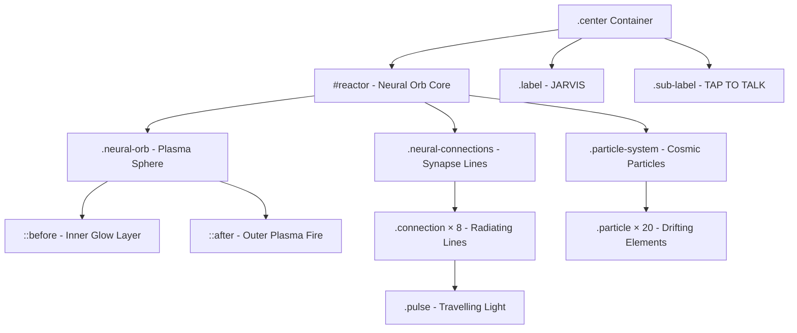
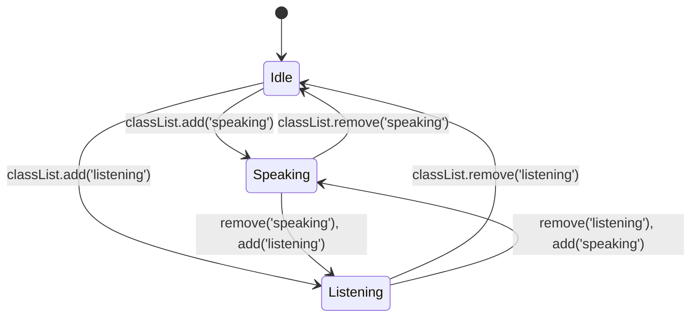

# Design Document: Neural Orb Redesign

## Overview

This design replaces the current molecular/orbiting-electron orb in the JARVIS interface with a neural-core aesthetic. The new design centers on a large fiery blue plasma sphere surrounded by neural network connections, cosmic particle systems, and synapse firing effects. The orb maintains all existing interactive states (idle, speaking, listening) and the tap-to-talk interaction via the same `handleOrb()` JavaScript function.

The implementation is purely front-end: CSS animations, HTML structure changes within the `.center` container, and minimal JavaScript adjustments for state class management. The backend remains untouched.

### Design Goals

- Replace the `.molecule`/`.orbit`/`.electron`/`.nucleus` DOM structure with a neural-core design
- Achieve a "living energy source" aesthetic using CSS gradients, box-shadows, animations, and pseudo-elements
- Maintain 60fps performance using GPU-accelerated properties (transform, opacity)
- Preserve full compatibility with existing JavaScript state management (`reactor.classList.add/remove`)
- Support responsive scaling for mobile viewports ≤500px

## Architecture

The neural orb is implemented as a self-contained CSS animation system within the existing `.center` container. No external libraries or canvas rendering is required — the entire effect uses HTML elements with CSS animations.



### State Management Flow



State transitions are controlled by CSS classes on the `#reactor` element, exactly as the current implementation does. No JavaScript animation logic changes are needed.

## Components and Interfaces

### 1. Neural Orb Core (`.neural-orb`)

The primary sphere element rendered with radial gradients and multi-layered box-shadows.

**Structure:**
```html
<div class="neural-orb">
  <!-- ::before = inner glow layer -->
  <!-- ::after = outer plasma fire effect -->
</div>
```

**CSS Properties:**
- `width/height`: 140px (desktop), 100px (mobile ≤500px)
- `border-radius`: 50%
- `background`: radial-gradient from #00e5ff center to #0040ff edges
- `box-shadow`: Multi-layer glow (60px+ outer radius)
- `animation`: `orbBreathe` — slow scale/opacity pulse (3-5s cycle in idle)
- `transition`: all 300ms ease — for state color/size changes

**State Variants:**
- `.speaking .neural-orb`: scale(1.15), intensified box-shadow, faster breathe cycle
- `.listening .neural-orb`: color shift to #00ff88, rhythmic pulse (1-2s cycle)

### 2. Plasma Fire Effect (pseudo-elements)

Implemented via `::before` and `::after` on `.neural-orb`:

- `::before`: Inner glow — larger semi-transparent circle with blur, creates volumetric depth
- `::after`: Outer plasma — animated radial gradient with flickering opacity (2-4s idle, 0.5-1.5s speaking)

Both use `pointer-events: none` and absolute positioning to avoid interfering with click targets.

### 3. Neural Connections (`.neural-connections`)

Container holding 8 radiating connection lines using absolute positioning and rotation transforms.

**Structure:**
```html
<div class="neural-connections">
  <div class="connection" style="--angle: 0deg; --length: 80px">
    <div class="pulse"></div>
  </div>
  <div class="connection" style="--angle: 45deg; --length: 65px">
    <div class="pulse"></div>
  </div>
  <!-- ... 6 more connections with varied angles/lengths -->
</div>
```

**Animation:**
- Each `.connection` is a thin line (1-2px width) rotated via `transform: rotate(var(--angle))`
- `.pulse` element travels along the line using `translateX` animation
- Idle: pulse every 2-4s per connection (staggered via `animation-delay`)
- Speaking: pulse every 0.5-1s
- Listening: color shift to green-cyan palette

### 4. Particle System (`.particle-system`)

20 small particle elements animated with CSS keyframes, varying in size, position, and timing.

**Structure:**
```html
<div class="particle-system">
  <div class="particle" style="--size: 2px; --delay: 0s; --duration: 8s; --start-angle: 30deg"></div>
  <div class="particle" style="--size: 3px; --delay: 1.2s; --duration: 10s; --start-angle: 120deg"></div>
  <!-- ... 18 more particles -->
</div>
```

**CSS Properties:**
- `pointer-events: none` on container and all particles
- `will-change: transform, opacity` for GPU optimization
- Size range: 1-4px via CSS custom properties
- Colors: blue-cyan palette with opacity 0.2-0.8
- Animation: `particleDrift` — orbit/drift outward (6-12s idle, 3-6s speaking)

### 5. Orb Container (`#reactor`)

The click target element wrapping the visual components.

**Structure:**
```html
<div id="reactor" onclick="handleOrb()" style="cursor: pointer">
  <div class="neural-orb"></div>
  <div class="neural-connections">...</div>
  <div class="particle-system">...</div>
</div>
```

**Preserved attributes:**
- `id="reactor"` — for JavaScript getElementById references
- `onclick="handleOrb()"` — existing tap-to-talk handler
- State classes: `.speaking`, `.listening` applied directly to `#reactor`

## Data Models

This feature has no data persistence or server-side data models. All state is managed via CSS classes on DOM elements.

### CSS Custom Properties (Design Tokens)

```css
:root {
  --orb-primary: #00e5ff;
  --orb-deep: #0040ff;
  --orb-listening: #00ff88;
  --orb-glow-idle: 60px;
  --orb-glow-speaking: 90px;
  --orb-size-desktop: 140px;
  --orb-size-mobile: 100px;
  --transition-state: 300ms ease;
  --particle-count: 20;
  --connection-count: 8;
}
```

### Animation Timing Map

| State     | Breathe Cycle | Particle Speed | Pulse Interval | Plasma Flicker |
|-----------|--------------|----------------|----------------|----------------|
| Idle      | 3-5s         | 6-12s          | 2-4s           | 2-4s           |
| Speaking  | 1-2s         | 3-6s           | 0.5-1s         | 0.5-1.5s       |
| Listening | 1-2s         | 4-8s           | 1-2s           | 1-2s           |

## Correctness Properties

*A property is a characteristic or behavior that should hold true across all valid executions of a system — essentially, a formal statement about what the system should do. Properties serve as the bridge between human-readable specifications and machine-verifiable correctness guarantees.*

Formal property-based testing (PBT) is **not applicable** to this feature. The neural orb redesign is a purely visual/CSS animation feature with no pure functions, data transformations, or algorithmic logic that would benefit from universal property verification.

**Why PBT does not apply:**

- **UI rendering and layout** — All acceptance criteria define visual appearance (colors, sizes, animation timings, DOM structure) rather than computed behavior across varying inputs.
- **No meaningful input variation** — The feature responds to three fixed states (idle, speaking, listening) with predetermined CSS values. There is no input space to explore.
- **Side-effect-only visual output** — Animations and rendering are visual side effects that cannot be expressed as "for all X, property P(X) holds" statements.
- **Configuration-style requirements** — Most criteria specify that specific CSS values are present (e.g., "color SHALL be #00e5ff"), which are verified by example-based assertions, not property generators.

**Alternative verification strategy:** DOM structure tests, CSS computed style assertions, visual regression screenshots, and state transition integration tests provide comprehensive coverage. See the Testing Strategy section below for details.

### Property 1: No Applicable Properties

This feature has no correctness properties suitable for property-based testing. All acceptance criteria define visual appearance, CSS animation timings, and DOM structure — none of which vary meaningfully with input or can be universally quantified. Verification is performed through example-based DOM/CSS assertions, visual regression tests, and manual performance checks.

**Validates: Requirements 1.1, 2.1, 3.1, 4.1, 5.1, 6.1, 7.1, 8.1, 9.1, 10.1, 11.1, 12.1**

## Error Handling

### CSS Animation Fallback

If the browser does not support CSS animations (detected via `@supports`), the orb degrades to a static blue sphere with box-shadow glow. The `@supports not (animation: none)` block provides:
- Static radial-gradient sphere
- Single-layer box-shadow glow
- No particles or connections rendered

### Performance Degradation

If frame drops are detected (via optional `requestAnimationFrame` monitoring), the particle count can be reduced by adding a `.reduced-motion` class. Additionally, the CSS respects `prefers-reduced-motion`:

```css
@media (prefers-reduced-motion: reduce) {
  .neural-orb, .particle, .connection .pulse, .neural-orb::after {
    animation: none !important;
  }
  .neural-orb {
    box-shadow: 0 0 40px rgba(0, 229, 255, 0.5);
  }
}
```

### Click Target Preservation

All decorative elements (particles, connections, plasma pseudo-elements) use `pointer-events: none` to ensure the core `#reactor` element always receives click events regardless of z-index layering.

### State Class Conflicts

If both `.speaking` and `.listening` are applied simultaneously (edge case during rapid state changes), `.listening` takes CSS precedence via selector specificity ordering. The JavaScript already ensures mutual exclusivity via `classList.remove` before `classList.add`.

## Testing Strategy

### Assessment: Property-Based Testing Applicability

PBT is **NOT applicable** for this feature because:

1. **UI rendering and layout** — The feature defines visual appearance, CSS animations, color values, and DOM structure. There are no pure functions with meaningful input/output behavior.
2. **No input variation** — The acceptance criteria specify fixed CSS values (colors, sizes, timings) that don't vary with user input.
3. **Side-effect-only visual output** — Animation behaviors are visual and cannot be universally quantified with "for all X, property P(X) holds" statements.
4. **CSS configuration** — Most requirements are about specific CSS property values being present, not about computed behavior across inputs.

### Recommended Testing Approach

#### Visual Regression Tests (Primary)
- Screenshot comparison tests for each state (idle, speaking, listening)
- Tests run against a headless browser (Playwright or Puppeteer)
- Compare against baseline screenshots for pixel-level accuracy

#### DOM Structure Tests (Unit)
- Verify the `#reactor` element exists with correct `onclick` attribute
- Verify `.neural-orb`, `.neural-connections`, `.particle-system` elements are present
- Verify particle count (≥15 elements with `.particle` class)
- Verify connection count (≥6 elements with `.connection` class)
- Verify `pointer-events: none` on particle and connection containers
- Verify `.sub-label` contains "TAP TO TALK"

#### CSS Computed Style Tests (Unit)
- Verify orb dimensions meet minimum 120px requirement
- Verify color values match palette specifications
- Verify `cursor: pointer` on the reactor element
- Verify `will-change` property on animated elements
- Verify responsive sizing at viewport ≤500px

#### State Transition Tests (Integration)
- Add `.speaking` class → verify glow radius increases, particle speed increases
- Add `.listening` class → verify color shifts to green-cyan
- Remove state class → verify return to idle appearance within 400ms
- Verify transition duration is between 200-400ms

#### Interaction Tests (Integration)
- Click `#reactor` → verify `handleOrb()` is called
- Verify click feedback animation (scale/flash) completes within 150ms
- Verify particles don't block click events

#### Performance Tests (Manual/CI)
- Measure frame rate during idle animation (target: 60fps)
- Measure frame rate during state transitions
- Verify no layout thrashing (only transform/opacity animations)

#### Accessibility
- Verify `prefers-reduced-motion` disables animations
- Verify orb remains visible without animations (static fallback)

### Test Tools
- **Playwright** for DOM structure and computed style assertions
- **Percy or Chromatic** for visual regression baselines (optional)
- **Chrome DevTools Performance panel** for manual fps verification
