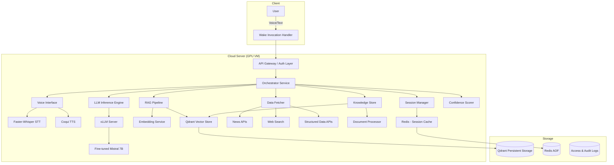
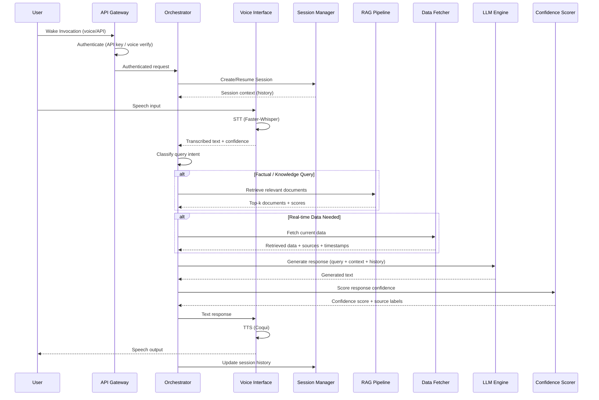

# Design Document: Personal AI Model (JARVIS-Style Assistant)

## Overview

This document describes the technical design for a personal AI assistant system built on a fine-tuned open-source LLM (LLaMA or Mistral). The system integrates voice-based interaction, RAG-grounded knowledge retrieval, real-time data fetching, hallucination mitigation, and always-available cloud deployment into a single cohesive personal assistant.

The architecture follows a modular microservice-oriented approach where each subsystem (Voice Interface, LLM Inference, RAG Pipeline, Data Fetcher, Knowledge Store) operates as an independent component communicating through well-defined internal APIs. This enables independent scaling, testing, and upgrades of each component.

### Key Design Decisions

| Decision | Choice | Rationale |
|----------|--------|-----------|
| LLM Framework | Mistral 7B with QLoRA fine-tuning | Strong performance at 7B scale, fits single GPU, open-source, supports 8K+ context |
| Inference Engine | vLLM with PagedAttention | Efficient GPU memory management, high throughput, OpenAI-compatible API |
| Speech-to-Text | Faster-Whisper (CTranslate2) | 4x faster than original Whisper, INT8/FP16 quantization, <2s latency |
| Text-to-Speech | Coqui TTS (XTTS v2) | Open-source, configurable voices, streaming support |
| Vector Database | Qdrant | High-performance HNSW indexing, supports filtering, production-proven |
| Embedding Model | sentence-transformers (all-MiniLM-L6-v2 or e5-large) | Good quality/speed tradeoff, 384-768 dimensions |
| Cloud Platform | Single GPU VM (A100/A10G) with Docker Compose | Simplicity for single-user system, GPU sharing across components |
| Fine-tuning | QLoRA via PEFT/Hugging Face | Memory-efficient, preserves base model, supports incremental training |

## Architecture

### High-Level System Architecture



### Request Flow



## Components and Interfaces

### 1. API Gateway / Authentication Layer

**Responsibility:** Entry point for all requests; handles authentication, rate limiting, and TLS termination.

```typescript
interface APIGateway {
  // Authenticate incoming request
  authenticate(request: IncomingRequest): Promise<AuthResult>;
  // Track failed attempts for lockout
  recordFailedAttempt(source: string): void;
  // Check if source is blocked
  isBlocked(source: string): boolean;
}

interface AuthResult {
  authenticated: boolean;
  userId: string | null;
  method: 'api_key' | 'voice_biometric';
  error?: string;
}

interface IncomingRequest {
  apiKey?: string;
  voiceSample?: AudioBuffer;
  sourceIp: string;
  timestamp: Date;
}
```

### 2. Orchestrator Service

**Responsibility:** Central coordination of all subsystems; routes queries, assembles context, manages multi-step tasks.

```typescript
interface Orchestrator {
  // Process a user query end-to-end
  processQuery(session: Session, query: UserQuery): Promise<AssistantResponse>;
  // Decompose complex tasks into subtasks
  decomposeTask(query: UserQuery): Promise<SubTask[]>;
  // Execute subtasks sequentially
  executeSubTasks(session: Session, tasks: SubTask[]): Promise<TaskResult[]>;
}

interface UserQuery {
  text: string;
  transcriptionConfidence: number;
  sessionId: string;
  timestamp: Date;
}

interface AssistantResponse {
  text: string;
  confidenceScore: number;
  sourceLabels: SourceLabel[];
  citations: Citation[];
  disclaimers: string[];
}

interface SubTask {
  id: number;
  description: string;
  type: 'lookup' | 'summarization' | 'reminder' | 'calculation' | 'creative';
  dependencies: number[];
}

interface TaskResult {
  subtaskId: number;
  status: 'completed' | 'failed' | 'skipped';
  result?: string;
  error?: string;
}
```

### 3. Voice Interface

**Responsibility:** Speech-to-text and text-to-speech conversion; continuous listening management; voice configuration.

```typescript
interface VoiceInterface {
  // Convert speech to text
  transcribe(audio: AudioStream): Promise<TranscriptionResult>;
  // Convert text to speech
  synthesize(text: string, config: VoiceConfig): Promise<AudioStream>;
  // Start continuous listening session
  startListening(sessionId: string): void;
  // Stop listening
  stopListening(sessionId: string): void;
}

interface TranscriptionResult {
  text: string;
  confidence: number;  // 0.0 - 1.0
  language: string;
  durationMs: number;
}

interface VoiceConfig {
  speed: number;       // 0.5 - 2.0
  pitch: number;       // 0.5 - 2.0
  voiceId: string;     // from available voices list
}

interface ListeningState {
  sessionId: string;
  isActive: boolean;
  silenceDurationMs: number;
  retryCount: number;  // for low-confidence retries, max 3
}
```

### 4. LLM Inference Engine

**Responsibility:** Text generation via fine-tuned model; context window management; timeout handling.

```typescript
interface LLMEngine {
  // Generate a response given context
  generate(request: GenerationRequest): Promise<GenerationResult>;
  // Check model health
  healthCheck(): Promise<ModelHealth>;
  // Get current model version
  getModelVersion(): string;
}

interface GenerationRequest {
  prompt: string;
  context: string[];        // RAG-retrieved documents
  conversationHistory: Message[];
  maxTokens: number;
  temperature: number;
  timeoutMs: number;        // default 10000
}

interface GenerationResult {
  text: string;
  tokenCount: number;
  generationTimeMs: number;
  modelVersion: string;
  error?: string;
}

interface ModelHealth {
  status: 'healthy' | 'degraded' | 'unavailable';
  gpuUtilization: number;
  vramUsageMb: number;
  queueDepth: number;
}
```

### 5. RAG Pipeline

**Responsibility:** Document retrieval, embedding, similarity search, and source tracking.

```typescript
interface RAGPipeline {
  // Retrieve relevant documents for a query
  retrieve(query: string, config: RetrievalConfig): Promise<RetrievalResult>;
  // Index a new document
  indexDocument(document: DocumentInput): Promise<IndexResult>;
  // Remove a document
  removeDocument(documentId: string): Promise<void>;
}

interface RetrievalConfig {
  topK: number;             // 1-20, default 5
  relevanceThreshold: number; // 0.0-1.0, default 0.7
  timeoutMs: number;        // default 10000
}

interface RetrievalResult {
  documents: RetrievedDocument[];
  allBelowThreshold: boolean;
  queryEmbeddingTimeMs: number;
  searchTimeMs: number;
}

interface RetrievedDocument {
  id: string;
  content: string;
  similarityScore: number;
  source: string;
  indexedAt: Date;
}

interface DocumentInput {
  content: Buffer;
  format: 'text' | 'pdf' | 'html';
  metadata: Record<string, string>;
  sizeMb: number;           // max 50MB
}

interface IndexResult {
  documentId: string;
  chunksCreated: number;
  indexTimeMs: number;
  success: boolean;
}
```

### 6. Data Fetcher

**Responsibility:** Real-time data retrieval from external sources with fallback and verification logic.

```typescript
interface DataFetcher {
  // Fetch real-time data for a query
  fetch(query: DataQuery): Promise<DataFetchResult>;
}

interface DataQuery {
  text: string;
  categories: DataCategory[];
  maxAgeMinutes: number;    // default 15
  timeoutMs: number;        // default 10000
}

type DataCategory = 'news' | 'web_search' | 'weather' | 'finance' | 'sports';

interface DataFetchResult {
  items: DataItem[];
  failedCategories: DataCategory[];
  allFailed: boolean;
}

interface DataItem {
  content: string;
  source: string;
  retrievedAt: Date;
  category: DataCategory;
  verified: boolean;        // true if corroborated by 2+ sources
}
```

### 7. Confidence Scorer

**Responsibility:** Assess response grounding; label segments by source basis; compute confidence scores.

```typescript
interface ConfidenceScorer {
  // Score a generated response against its sources
  score(response: string, context: ScoringContext): Promise<ConfidenceResult>;
}

interface ScoringContext {
  retrievedDocuments: RetrievedDocument[];
  fetchedData: DataItem[];
  query: string;
}

interface ConfidenceResult {
  overallScore: number;     // 0.0 - 1.0
  segments: ResponseSegment[];
  needsDisclaimer: boolean; // true if score < threshold (default 0.7)
}

interface ResponseSegment {
  text: string;
  sourceBasis: 'retrieved_evidence' | 'model_knowledge';
  supportingDocIds: string[];
  segmentConfidence: number;
}
```

### 8. Session Manager

**Responsibility:** Maintain conversation history; handle session lifecycle; persist user preferences.

```typescript
interface SessionManager {
  // Create a new session
  createSession(userId: string): Promise<Session>;
  // Get existing session
  getSession(sessionId: string): Promise<Session | null>;
  // Update session with new exchange
  addExchange(sessionId: string, exchange: Exchange): Promise<void>;
  // End a session
  endSession(sessionId: string): Promise<void>;
}

interface Session {
  id: string;
  userId: string;
  startedAt: Date;
  lastActivityAt: Date;
  exchanges: Exchange[];    // max 50 retained
  isActive: boolean;
}

interface Exchange {
  userMessage: string;
  assistantResponse: string;
  timestamp: Date;
  metadata: ExchangeMetadata;
}

interface ExchangeMetadata {
  confidenceScore: number;
  sourcesUsed: string[];
  responseTimeMs: number;
}
```

### 9. Knowledge Store Manager

**Responsibility:** Persistent storage of user preferences and facts; document lifecycle management.

```typescript
interface KnowledgeStoreManager {
  // Store a user preference or fact
  storeItem(userId: string, item: KnowledgeItem): Promise<string>;
  // Remove an item
  removeItem(userId: string, itemId: string): Promise<void>;
  // Get all stored items for user
  getItems(userId: string): Promise<KnowledgeItem[]>;
  // Count items
  getItemCount(userId: string): Promise<number>;
}

interface KnowledgeItem {
  id: string;
  type: 'preference' | 'fact' | 'document';
  content: string;
  createdAt: Date;
  metadata: Record<string, string>;
}
```

## Data Models

### Core Entities

```typescript
// User profile and configuration
interface UserProfile {
  id: string;
  voiceConfig: VoiceConfig;
  confidenceThreshold: number;    // default 0.7
  ragTopK: number;                // default 5
  ragRelevanceThreshold: number;  // default 0.7
  dataRetentionDays: number;
  trainingOptIn: boolean;         // default false
  createdAt: Date;
  updatedAt: Date;
}

// Conversation log entry (stored encrypted)
interface ConversationLog {
  id: string;
  sessionId: string;
  userId: string;
  exchanges: Exchange[];
  startedAt: Date;
  endedAt: Date;
  metadata: {
    totalExchanges: number;
    averageConfidence: number;
    sourcesUsed: string[];
  };
}

// Authentication access log
interface AccessLogEntry {
  id: string;
  timestamp: Date;
  sourceIp: string;
  method: 'api_key' | 'voice_biometric';
  success: boolean;
  userId?: string;
  failureReason?: string;
}

// Document stored in Knowledge Store
interface StoredDocument {
  id: string;
  userId: string;
  originalFormat: 'text' | 'pdf' | 'html';
  sizeMb: number;
  chunks: DocumentChunk[];
  indexedAt: Date;
  metadata: Record<string, string>;
}

interface DocumentChunk {
  id: string;
  documentId: string;
  content: string;
  embedding: number[];      // vector representation
  chunkIndex: number;
  tokenCount: number;
}

// Fine-tuning model version record
interface ModelVersion {
  id: string;
  baseModel: string;        // e.g., "mistral-7b-instruct-v0.2"
  version: string;
  trainingExamples: number;
  evaluationScore: number;  // on held-out test set
  createdAt: Date;
  status: 'active' | 'archived' | 'rolled_back';
  loraWeightsPath: string;
}

// Multi-step task execution record
interface TaskExecution {
  id: string;
  sessionId: string;
  originalQuery: string;
  subtasks: SubTaskRecord[];
  status: 'in_progress' | 'completed' | 'partially_failed';
  startedAt: Date;
  completedAt?: Date;
}

interface SubTaskRecord {
  id: number;
  description: string;
  status: 'pending' | 'running' | 'completed' | 'failed' | 'skipped';
  result?: string;
  error?: string;
  startedAt?: Date;
  completedAt?: Date;
}

// Alert configuration
interface AlertConfig {
  cpuThreshold: number;     // default 80%
  memoryThreshold: number;  // default 80%
  gpuThreshold: number;     // default 80%
  diskThreshold: number;    // default 80%
  notificationChannel: 'email' | 'webhook' | 'sms';
  notificationTarget: string;
}
```

### Storage Layout

| Data | Storage | Encryption | Retention |
|------|---------|------------|-----------|
| Conversation logs | Local filesystem (encrypted) | AES-256 at rest | User-configurable |
| Vector embeddings | Qdrant (persistent volume) | AES-256 at rest | Until user deletes |
| Session state | Redis (AOF persistence) | TLS in transit | Session lifetime + 24h |
| Access logs | Append-only log file | AES-256 at rest | Minimum 90 days |
| Model weights | Local filesystem | AES-256 at rest | All versions retained |
| User preferences | Qdrant metadata + Redis | AES-256 at rest | Until user deletes |

## Correctness Properties

*A property is a characteristic or behavior that should hold true across all valid executions of a system — essentially, a formal statement about what the system should do. Properties serve as the bridge between human-readable specifications and machine-verifiable correctness guarantees.*

### Property 1: Session Inactivity Timeout

*For any* active session and any silence duration, the system SHALL mark the session as inactive and trigger a notification if and only if the silence duration is greater than or equal to 60 seconds; otherwise the session SHALL remain active.

**Validates: Requirements 1.3, 1.6**

### Property 2: Transcription Retry State Machine

*For any* sequence of transcription confidence scores, the system SHALL prompt for retry on each score below 0.50, count consecutive low-confidence results, and transition to a "recognition failed" state after exactly 3 consecutive retries — never before and never after.

**Validates: Requirements 1.4**

### Property 3: Voice Configuration Boundary Validation

*For any* voice configuration input, the system SHALL accept the configuration if and only if speed is in [0.5, 2.0], pitch is in [0.5, 2.0], and voiceId is in the set of available voices; all other configurations SHALL be rejected.

**Validates: Requirements 1.5**

### Property 4: Server Recovery Retry Logic

*For any* sequence of recovery attempts after a server failure, the system SHALL retry up to 3 times; if any attempt succeeds the system SHALL resume availability; if all 3 fail the system SHALL notify the user of unavailability and stop retrying.

**Validates: Requirements 2.3**

### Property 5: Session Continuity on Duplicate Invocation

*For any* active session, receiving a Wake_Invocation SHALL NOT create a new session; the existing session SHALL continue with its full history intact, and the session count SHALL remain unchanged.

**Validates: Requirements 2.6**

### Property 6: Data Freshness Filtering

*For any* set of retrieved data items, the Data_Fetcher SHALL include in its results only items whose retrieval timestamp is within 15 minutes of the request time; items older than 15 minutes SHALL be excluded.

**Validates: Requirements 3.1**

### Property 7: Citation Formatting Completeness

*For any* data item included in a response, the formatted output SHALL contain both the source name and the retrieval timestamp of that item.

**Validates: Requirements 3.2**

### Property 8: Data Fetch Fallback and Terminal Failure

*For any* data fetch request targeting a category, if the primary source fails, the system SHALL attempt at least 2 alternative sources from the same category before reporting failure; if all sources across all requested categories fail, the error message SHALL list every category that was attempted.

**Validates: Requirements 3.4, 3.5**

### Property 9: Source Verification Labeling

*For any* data item presented to the user, it SHALL be labeled "verified" if and only if it is corroborated by at least 2 independent sources; otherwise it SHALL be labeled "unverified".

**Validates: Requirements 3.6**

### Property 10: RAG Retrieval Filtering and Ranking

*For any* set of documents in the Knowledge_Store, a retrieval query with parameters (threshold, k) SHALL return at most k documents, each with similarity score >= threshold, sorted in descending order by score; if no documents meet the threshold, the system SHALL produce a "no supporting sources" disclaimer.

**Validates: Requirements 4.1, 4.2, 4.3**

### Property 11: RAG Citation Inclusion

*For any* response to a factual query that uses RAG-retrieved documents, every factual claim in the response SHALL reference at least one supporting document ID from the retrieved set.

**Validates: Requirements 4.6**

### Property 12: Confidence Score Validity and Threshold Disclaimer

*For any* response about factual data, the confidence score SHALL be a numeric value in [0.0, 1.0]; if the score is below the configured threshold (default 0.7), the response SHALL include a disclaimer; if at or above, no disclaimer SHALL be present.

**Validates: Requirements 5.1, 5.2**

### Property 13: Response Segment Source Labeling

*For any* generated response, every segment SHALL be labeled with exactly one source basis — either "retrieved evidence" or "generated from model knowledge"; segments without supporting evidence from retrieval sources SHALL be labeled as "unverified" rather than presented as fact.

**Validates: Requirements 5.3, 5.4, 5.5**

### Property 14: Generation Timeout Enforcement

*For any* LLM generation request, if the generation exceeds 10 seconds without completing, the system SHALL terminate the attempt and return an error indication; no partial or stale response SHALL be delivered.

**Validates: Requirements 6.6**

### Property 15: Model Rollback Decision Logic

*For any* incremental fine-tuning result, if the evaluation score on the held-out test set is below 60%, the system SHALL trigger a rollback to the previous model version; if the score is >= 60%, the new model SHALL be retained.

**Validates: Requirements 6.7**

### Property 16: Task Decomposition Bounds

*For any* complex user request decomposed into subtasks, the number of subtasks SHALL be between 1 and 10 inclusive; no decomposition SHALL produce more than 10 subtasks.

**Validates: Requirements 7.1**

### Property 17: Session History Retention Invariant

*For any* active session after N exchanges (where N > 50), the session SHALL retain at least the 50 most recent exchanges; for N <= 50, all exchanges SHALL be retained.

**Validates: Requirements 7.2**

### Property 18: Knowledge Store Capacity Enforcement

*For any* user, the Knowledge_Store SHALL accept new items only while the total item count is below 500; attempts to store beyond 500 items SHALL be rejected; deletion of an item SHALL reduce the count by exactly 1.

**Validates: Requirements 7.3**

### Property 19: Subtask Failure Preservation

*For any* multi-step task execution where subtask N fails, the results of all subtasks 1 through N-1 that completed successfully SHALL be preserved and accessible; the system SHALL correctly identify subtask N as the failed step.

**Validates: Requirements 7.6**

### Property 20: Resource Alert Threshold

*For any* resource metric (CPU, memory, GPU, disk), when utilization exceeds 80%, the system SHALL emit an alert; when utilization is at or below 80%, no alert SHALL be emitted.

**Validates: Requirements 8.3**

### Property 21: Authentication Access Control

*For any* incoming request, access SHALL be granted if and only if valid credentials (API key or verified voice biometric) are provided; failed authentication SHALL produce an error response indicating invalid credentials AND create a log entry recording the attempt.

**Validates: Requirements 8.5, 8.6**

### Property 22: Data Isolation in Outbound Queries

*For any* outbound request from the Data_Fetcher to an external service, the request payload SHALL contain only the search query text; no conversation context, session history, or personal data SHALL be included in the outbound payload.

**Validates: Requirements 9.2**

### Property 23: Deletion Completeness and Confirmation

*For any* user data deletion request specifying a set of items, after deletion completes, querying the Knowledge_Store and logs for those items SHALL return no results; the confirmation message SHALL list the deleted items and include a completion timestamp.

**Validates: Requirements 9.3**

### Property 24: Access Log Retention

*For any* access log entry, the system SHALL retain it for at least 90 days from creation; deletion attempts on entries younger than 90 days SHALL be rejected.

**Validates: Requirements 9.4**

### Property 25: Training Opt-In Enforcement

*For any* training data ingestion request, the system SHALL proceed with training if and only if the user's opt-in setting is true; if opt-in is false, the training request SHALL be rejected and no conversation data SHALL be used.

**Validates: Requirements 9.5**

### Property 26: Authentication Lockout Logic

*For any* source IP, if 5 consecutive failed authentication attempts occur within a 10-minute window, the system SHALL block all further attempts from that source for at least 15 minutes; fewer than 5 consecutive failures within 10 minutes SHALL NOT trigger lockout; a successful attempt SHALL reset the consecutive failure count.

**Validates: Requirements 9.6**

### Property 27: Data Access Authorization

*For any* request to access stored conversation logs or personal data, the system SHALL permit access if and only if the requesting session belongs to the authenticated owner of that data; requests from any other session SHALL be denied.

**Validates: Requirements 9.7**

## Error Handling

### Error Categories and Responses

| Error Category | Trigger | System Response | User-Facing Message |
|---------------|---------|-----------------|---------------------|
| STT Failure | Confidence < 50% | Retry up to 3 times | "Could you repeat that?" → "Sorry, I couldn't understand." |
| TTS Failure | Synthesis engine error | Fallback to text display | "Voice output unavailable, showing text response." |
| RAG Timeout | Knowledge_Store > 10s | Skip RAG, flag response | "Document retrieval unavailable, response may not be grounded." |
| Data Fetch Failure | All sources fail | Report failed categories | "Real-time data unavailable for [categories]." |
| LLM Timeout | Generation > 10s | Terminate, return error | "I'm having trouble generating a response, please try again." |
| Auth Failure | Invalid credentials | Deny + log | "Authentication failed. Access denied." |
| Lockout | 5 consecutive failures | Block 15 min | "Too many failed attempts. Try again later." |
| Server Failure | Infrastructure crash | Retry 3x, then notify | "Service temporarily unavailable." |
| Capacity Exceeded | Knowledge items > 500 | Reject new item | "Storage limit reached. Remove items to add new ones." |
| Subtask Failure | Step in multi-step fails | Preserve prior results | "Step N failed. Previous steps preserved. Retry or skip?" |

### Error Propagation Strategy

1. **Local Recovery First**: Each component handles retries internally before escalating
2. **Graceful Degradation**: If a non-critical component fails (e.g., RAG), the system continues with reduced capability and informs the user
3. **Fail-Safe Defaults**: When uncertain, the system labels responses as "unverified" and includes disclaimers rather than presenting ungrounded information as fact
4. **Session Preservation**: Errors in one exchange do not corrupt the session; the session state remains valid after any error

### Circuit Breaker Pattern

Components that call external services (Data_Fetcher, Knowledge_Store) implement circuit breakers:
- **Closed**: Normal operation, requests pass through
- **Open**: After 3 consecutive failures, stop sending requests for 30 seconds
- **Half-Open**: After cooldown, allow 1 test request; if successful, close; if failed, reopen

## Testing Strategy

### Dual Testing Approach

This system benefits from both property-based testing and traditional testing approaches:

#### Property-Based Testing (PBT)

Property-based testing is highly applicable to this feature because it contains significant pure logic components:
- Threshold/boundary logic (confidence scores, timeout durations, capacity limits)
- State machine transitions (retry logic, lockout, session lifecycle)
- Filtering and ranking algorithms (RAG retrieval, data freshness)
- Input validation (voice config, auth credentials)
- Invariant preservation (session history, knowledge store capacity)

**Library**: [fast-check](https://github.com/dubzzz/fast-check) (TypeScript/JavaScript)

**Configuration**:
- Minimum 100 iterations per property test
- Each property test tagged with: `Feature: personal-ai-model, Property {N}: {property_text}`
- Generators for: confidence scores (0.0-1.0), timestamps, auth attempt sequences, document sets with similarity scores, voice configurations, resource utilization values

**Key property tests to implement** (mapped to Correctness Properties above):
- Property 2: Retry state machine (sequences of confidence values)
- Property 3: Voice config validation (random configs)
- Property 10: RAG filtering and ranking (random document sets)
- Property 12: Confidence scoring and disclaimer logic
- Property 16: Task decomposition bounds
- Property 17: Session history invariant
- Property 18: Knowledge store capacity
- Property 21: Auth access control
- Property 26: Lockout logic (sequences of auth attempts with timestamps)

#### Unit Tests (Example-Based)

Unit tests complement property tests for specific scenarios and edge cases:
- Session end confirmation (Req 2.4)
- Knowledge_Store timeout handling (Req 4.7)
- Unsupported task capability message (Req 7.5)
- Specific voice config boundary values (0.5, 2.0 exactly)
- Empty query handling

#### Integration Tests

Integration tests verify end-to-end behavior with real or emulated external services:
- STT accuracy benchmark (Req 1.1)
- TTS latency measurement (Req 1.2)
- Document indexing across formats (Req 4.4)
- Indexing latency for 10MB documents (Req 4.5)
- LLM response latency under load (Req 6.4, 8.2)
- Fine-tuning evaluation score (Req 6.2, 6.3)
- Full request flow: voice → STT → orchestrator → RAG → LLM → TTS → voice

#### Smoke Tests

Smoke tests verify deployment and configuration:
- All services running and healthy (Req 8.1)
- Model is from approved family (Req 6.1)
- Context window >= 8000 tokens (Req 6.5)
- Encryption configuration correct (Req 8.4)
- All required data source categories registered (Req 3.3)
- All required task categories supported (Req 7.4)
- Uptime monitoring active (Req 2.2, 2.5, 8.7)

### Test Organization

```
tests/
├── property/                  # Property-based tests (fast-check)
│   ├── session-timeout.prop.ts
│   ├── retry-logic.prop.ts
│   ├── voice-config.prop.ts
│   ├── rag-retrieval.prop.ts
│   ├── confidence-scoring.prop.ts
│   ├── task-decomposition.prop.ts
│   ├── knowledge-store.prop.ts
│   ├── auth-lockout.prop.ts
│   ├── data-freshness.prop.ts
│   └── source-labeling.prop.ts
├── unit/                      # Example-based unit tests
│   ├── orchestrator.test.ts
│   ├── voice-interface.test.ts
│   ├── data-fetcher.test.ts
│   ├── session-manager.test.ts
│   └── confidence-scorer.test.ts
├── integration/               # Integration tests
│   ├── stt-accuracy.test.ts
│   ├── tts-latency.test.ts
│   ├── rag-indexing.test.ts
│   ├── llm-inference.test.ts
│   └── end-to-end-flow.test.ts
└── smoke/                     # Smoke/deployment tests
    ├── services-health.test.ts
    ├── encryption-config.test.ts
    └── model-config.test.ts
```

