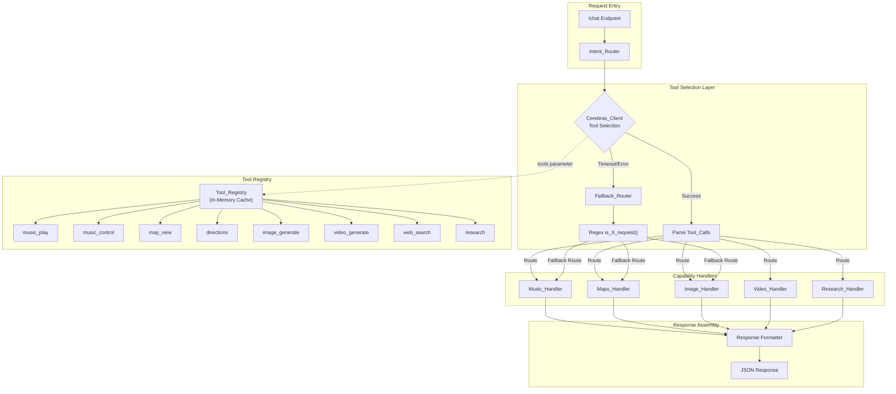
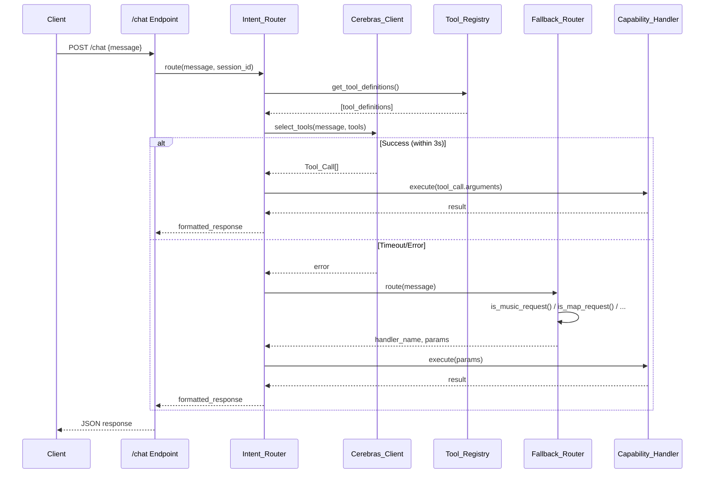
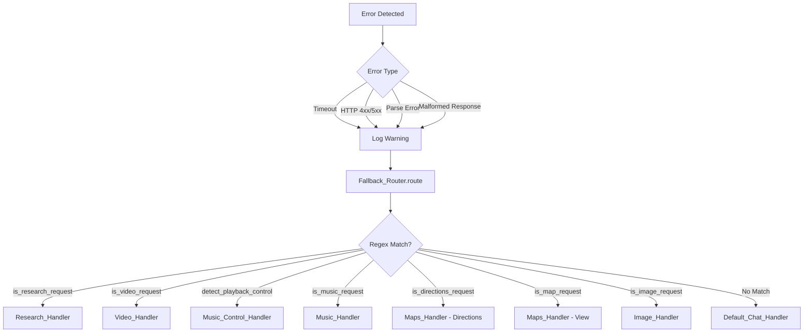

# Technical Design Document: Tool Calling Routing

## Overview

This design document specifies the technical architecture for refactoring FRIDAY's intent routing system from regex-based pattern matching to LLM-native tool/function calling via the Cerebras API. The current implementation in `app.py` uses a cascade of `is_X_request()` functions (e.g., `is_music_request()`, `is_map_request()`, `is_image_request()`) with hardcoded regex patterns to route user messages to capability handlers. This approach struggles with ambiguous requests, multi-intent messages, and evolving natural language patterns.

The new architecture introduces a **Tool_Registry** that maintains OpenAI-compatible tool definitions, an enhanced **Cerebras_Client** that supports tool calling, and a refactored **Intent_Router** that delegates routing decisions to the LLM. A **Fallback_Router** preserves the existing regex-based routing as a backup mechanism for reliability.

### Key Design Decisions

1. **OpenAI-Compatible Schema**: Tool definitions follow the OpenAI function calling format for maximum compatibility and future portability.
2. **Sequential Multi-Tool Execution**: When the LLM returns multiple tool calls, they execute sequentially (not in parallel) to maintain predictable state and simplify error handling.
3. **Graceful Degradation**: The Fallback_Router ensures the system remains functional when LLM tool selection fails, preserving the existing regex patterns.
4. **Response Format Preservation**: API responses maintain backward compatibility with the frontend, requiring no client-side changes.
5. **Connection Pooling**: The existing `requests.Session` pattern is extended to support tool calling without creating new connections.

## Architecture



### Component Interaction Flow



## Components and Interfaces

### Tool_Registry

The Tool_Registry is a centralized component that manages tool definitions and provides them to the Cerebras_Client for tool selection.

```python
from dataclasses import dataclass, field
from typing import Any, Optional
import json

@dataclass
class ToolDefinition:
    """A single tool definition conforming to OpenAI function calling schema."""
    name: str  # 1-64 characters
    description: str  # 1-1024 characters
    parameters: dict[str, Any]  # Valid JSON Schema object with "type": "object"
    handler_name: str  # Maps to the capability handler module

@dataclass
class ToolRegistrationError:
    """Error returned when tool registration fails validation."""
    field: str  # "name", "description", or "parameters"
    message: str

class ToolRegistry:
    """Centralized registry of tool definitions for LLM tool calling."""
    
    _instance: Optional['ToolRegistry'] = None
    _tools: dict[str, ToolDefinition] = field(default_factory=dict)
    
    @classmethod
    def get_instance(cls) -> 'ToolRegistry':
        """Return singleton instance (loaded once at startup)."""
        if cls._instance is None:
            cls._instance = cls()
            cls._instance._load_default_tools()
        return cls._instance
    
    def register(self, tool: ToolDefinition) -> Optional[ToolRegistrationError]:
        """Register a tool definition. Returns error if validation fails."""
        # Validate name (1-64 characters)
        if not tool.name or len(tool.name) < 1 or len(tool.name) > 64:
            return ToolRegistrationError("name", "Name must be 1-64 characters")
        
        # Validate description (1-1024 characters)
        if not tool.description or len(tool.description) < 1 or len(tool.description) > 1024:
            return ToolRegistrationError("description", "Description must be 1-1024 characters")
        
        # Validate parameters (must be valid JSON Schema with "type": "object")
        if not isinstance(tool.parameters, dict):
            return ToolRegistrationError("parameters", "Parameters must be a JSON Schema object")
        if tool.parameters.get("type") != "object":
            return ToolRegistrationError("parameters", "Parameters schema must have type: object")
        
        self._tools[tool.name] = tool
        return None
    
    def get_tool(self, name: str) -> Optional[ToolDefinition]:
        """Get a tool definition by name."""
        return self._tools.get(name)
    
    def get_all_tools(self) -> list[ToolDefinition]:
        """Get all registered tool definitions."""
        return list(self._tools.values())
    
    def get_openai_format(self) -> list[dict[str, Any]]:
        """Return tools in OpenAI function calling format."""
        return [
            {
                "type": "function",
                "function": {
                    "name": tool.name,
                    "description": tool.description,
                    "parameters": tool.parameters,
                }
            }
            for tool in self._tools.values()
        ]
    
    def _load_default_tools(self) -> None:
        """Load default tool definitions for all existing capabilities."""
        # Tool definitions loaded here at startup
        pass
```

### Cerebras_Client (Enhanced)

The existing `llm.py` module is extended to support tool calling:

```python
@dataclass
class ToolCall:
    """Parsed tool call from LLM response."""
    id: str
    function_name: str
    arguments: dict[str, Any]

@dataclass
class ToolSelectionResult:
    """Result of tool selection request."""
    tool_calls: list[ToolCall]
    assistant_content: Optional[str]  # Non-None if no tools selected
    error: Optional[str]  # Non-None if request failed

class CerebrasClient:
    """Enhanced Cerebras client with tool calling support."""
    
    def select_tools(
        self,
        message: str,
        tools: list[dict[str, Any]],
        tool_choice: str = "auto",  # "auto", "none", or specific tool name
        timeout: float = 3.0,
    ) -> ToolSelectionResult:
        """
        Send message to Cerebras with tool definitions and return tool selection.
        
        Args:
            message: User message to route
            tools: Tool definitions in OpenAI format
            tool_choice: Control tool selection behavior
            timeout: Request timeout in seconds
            
        Returns:
            ToolSelectionResult with tool_calls, assistant_content, or error
        """
        pass
```

### Intent_Router

The Intent_Router orchestrates tool selection and execution:

```python
@dataclass
class RoutingResult:
    """Result of intent routing."""
    response: dict[str, Any]  # JSON response to return to client
    handler_used: str  # Name of handler that processed the request
    is_fallback: bool  # True if fallback routing was used
    latency_ms: float  # Tool selection latency

class IntentRouter:
    """Routes user messages to capability handlers via LLM tool selection."""
    
    def __init__(
        self,
        tool_registry: ToolRegistry,
        cerebras_client: CerebrasClient,
        fallback_router: FallbackRouter,
    ):
        self._registry = tool_registry
        self._client = cerebras_client
        self._fallback = fallback_router
        self._handlers: dict[str, Callable] = {}
    
    def register_handler(self, tool_name: str, handler: Callable) -> None:
        """Register a capability handler for a tool name."""
        self._handlers[tool_name] = handler
    
    def route(
        self,
        message: str,
        session_id: str,
        user_id: str,
    ) -> RoutingResult:
        """
        Route a user message to the appropriate handler(s).
        
        Flow:
        1. Get tool definitions from registry
        2. Send to Cerebras for tool selection (3s timeout)
        3. On success: execute tool call(s) and format response
        4. On failure: delegate to FallbackRouter
        """
        pass
    
    def _execute_tool_calls(
        self,
        tool_calls: list[ToolCall],
        session_id: str,
        user_id: str,
    ) -> list[dict[str, Any]]:
        """Execute tool calls sequentially (max 5 per request)."""
        pass
```

### Fallback_Router

Preserves regex-based routing as a backup:

```python
@dataclass
class FallbackResult:
    """Result of fallback routing."""
    handler_name: str  # "music", "maps", "image", etc. or "default"
    parameters: dict[str, Any]  # Extracted parameters
    trigger_reason: str  # "timeout" or HTTP status code

class FallbackRouter:
    """Backup routing using regex-based is_X_request() functions."""
    
    def route(self, message: str, trigger_reason: str) -> FallbackResult:
        """
        Route message using existing regex patterns.
        
        Checks in priority order:
        1. detect_playback_control() -> music_control
        2. is_research_request() -> research
        3. is_video_request() -> video
        4. is_directions_request() -> directions
        5. is_map_request() -> map_view
        6. is_music_request() -> music_play
        7. is_image_request() -> image_generate
        8. default -> default_chat
        """
        pass
```

### Metrics Collector

Collects observability metrics:

```python
@dataclass
class RoutingMetrics:
    """Rolling metrics over 5-minute window."""
    total_requests: int
    successful_selections: int
    fallback_count: int
    total_latency_ms: float
    
    @property
    def success_rate(self) -> float:
        """Tool selection success rate as percentage."""
        if self.total_requests == 0:
            return 100.0
        return (self.successful_selections / self.total_requests) * 100
    
    @property
    def fallback_rate(self) -> float:
        """Fallback rate as percentage."""
        if self.total_requests == 0:
            return 0.0
        return (self.fallback_count / self.total_requests) * 100
    
    @property
    def average_latency_ms(self) -> float:
        """Average selection latency in milliseconds."""
        if self.successful_selections == 0:
            return 0.0
        return self.total_latency_ms / self.successful_selections

class MetricsCollector:
    """Collects routing metrics with rolling 5-minute window."""
    
    def record_selection(self, latency_ms: float, success: bool, fallback: bool) -> None:
        """Record a tool selection event."""
        pass
    
    def get_metrics(self) -> RoutingMetrics:
        """Get current metrics for health endpoint."""
        pass
```

## Data Models

### Tool Definitions

All tool definitions follow the OpenAI function calling schema:

```python
TOOL_DEFINITIONS = {
    "music_play": {
        "name": "music_play",
        "description": "Play music, songs, or audio tracks. Use when user wants to listen to, play, or queue music.",
        "parameters": {
            "type": "object",
            "properties": {
                "song_query": {
                    "type": "string",
                    "description": "The song, artist, or music query to search for",
                    "minLength": 1,
                    "maxLength": 500,
                }
            },
            "required": ["song_query"],
        },
        "handler_name": "music",
    },
    "music_control": {
        "name": "music_control",
        "description": "Control music playback - pause, resume, stop, skip to next track, or go to previous track.",
        "parameters": {
            "type": "object",
            "properties": {
                "action": {
                    "type": "string",
                    "enum": ["pause", "resume", "stop", "next", "previous"],
                    "description": "The playback control action to perform",
                }
            },
            "required": ["action"],
        },
        "handler_name": "music_control",
    },
    "map_view": {
        "name": "map_view",
        "description": "Display a map of a location or place. Use for 'show map of X', 'where is X', or location viewing.",
        "parameters": {
            "type": "object",
            "properties": {
                "place": {
                    "type": "string",
                    "description": "The location, city, or place to show on the map",
                    "minLength": 1,
                    "maxLength": 200,
                }
            },
            "required": ["place"],
        },
        "handler_name": "maps",
    },
    "directions": {
        "name": "directions",
        "description": "Get directions or navigation route between locations. Use for 'directions to X', 'how to get to X', or 'from A to B'.",
        "parameters": {
            "type": "object",
            "properties": {
                "destination": {
                    "type": "string",
                    "description": "The destination location",
                    "minLength": 1,
                    "maxLength": 200,
                },
                "origin": {
                    "type": "string",
                    "description": "The starting location (optional, current location if not specified)",
                    "maxLength": 200,
                    "default": "",
                }
            },
            "required": ["destination"],
        },
        "handler_name": "maps",
    },
    "image_generate": {
        "name": "image_generate",
        "description": "Generate an image from a text description. Use for creating pictures, artwork, illustrations, or visual content.",
        "parameters": {
            "type": "object",
            "properties": {
                "prompt": {
                    "type": "string",
                    "description": "Description of the image to generate",
                    "minLength": 1,
                    "maxLength": 1000,
                }
            },
            "required": ["prompt"],
        },
        "handler_name": "image",
    },
    "video_generate": {
        "name": "video_generate",
        "description": "Generate a video or animation from a text description. Use for creating video clips, animations, or motion content.",
        "parameters": {
            "type": "object",
            "properties": {
                "prompt": {
                    "type": "string",
                    "description": "Description of the video to generate",
                    "minLength": 1,
                    "maxLength": 1000,
                }
            },
            "required": ["prompt"],
        },
        "handler_name": "video",
    },
    "research": {
        "name": "research",
        "description": "Conduct deep research on a topic with multiple sources. Use for comprehensive analysis, detailed reports, or thorough investigation.",
        "parameters": {
            "type": "object",
            "properties": {
                "topic": {
                    "type": "string",
                    "description": "The topic to research",
                    "minLength": 1,
                    "maxLength": 500,
                }
            },
            "required": ["topic"],
        },
        "handler_name": "research",
    },
    "web_search": {
        "name": "web_search",
        "description": "Search the web for current information, news, facts, or general queries.",
        "parameters": {
            "type": "object",
            "properties": {
                "query": {
                    "type": "string",
                    "description": "The search query",
                    "minLength": 1,
                    "maxLength": 500,
                }
            },
            "required": ["query"],
        },
        "handler_name": "search",
    },
    "news": {
        "name": "news",
        "description": "Get latest news and headlines on a topic or category.",
        "parameters": {
            "type": "object",
            "properties": {
                "topic": {
                    "type": "string",
                    "description": "News topic or category (world, tech, business, or specific subject)",
                    "maxLength": 200,
                }
            },
            "required": [],
        },
        "handler_name": "news",
    },
    "weather": {
        "name": "weather",
        "description": "Get current weather or forecast for a location.",
        "parameters": {
            "type": "object",
            "properties": {
                "location": {
                    "type": "string",
                    "description": "The location to get weather for",
                    "minLength": 1,
                    "maxLength": 200,
                }
            },
            "required": ["location"],
        },
        "handler_name": "weather",
    },
    "stock": {
        "name": "stock",
        "description": "Get stock price, market data, or cryptocurrency information.",
        "parameters": {
            "type": "object",
            "properties": {
                "symbol": {
                    "type": "string",
                    "description": "Stock ticker symbol or cryptocurrency name",
                    "minLength": 1,
                    "maxLength": 50,
                }
            },
            "required": ["symbol"],
        },
        "handler_name": "stock",
    },
}
```

### Response Formats

Response formats are preserved for backward compatibility:

```python
# Music play response
{
    "reply": str,  # "Playing 'Song Title' by Artist..."
    "sessionId": str,
    "action": "play_music_embed",
    "track": {
        "video_id": str,
        "title": str,
        "artist": str,
        "thumbnail_url": str,
    }
}

# Music control response
{
    "reply": str,  # "Music paused, Sir."
    "sessionId": str,
    "action": "control_music",
    "control": str,  # "pause" | "resume" | "stop" | "next" | "previous"
}

# Map view response
{
    "reply": str,  # "Here is the map of Paris, Sir."
    "sessionId": str,
    "action": "show_map",
    "mode": "view",
    "place": str,
}

# Directions response
{
    "reply": str,  # "Plotting a route from A to B, Sir."
    "sessionId": str,
    "action": "show_map",
    "mode": "directions",
    "origin": str,
    "destination": str,
}

# Image response
{
    "reply": str,  # "Here's your image, Sir."
    "sessionId": str,
    "action": "show_image",
    "imageUrl": str,
    "imagePrompt": str,
}

# Video response
{
    "reply": str,  # "Generating your video, Sir."
    "sessionId": str,
    "action": "show_video",
    "videoUrl": str,
    "videoPrompt": str,
}

# Research response
{
    "reply": str,  # "Research complete. X sources in Ys."
    "sessionId": str,
    "action": "show_report",
    "report": str,
    "topic": str,
    "meta": {
        "sources": int,
        "news": int,
        "time": str,
    }
}

# Multi-intent response
{
    "reply": str,  # Summary of all actions
    "sessionId": str,
    "action": "multi_result",
    "results": [
        {
            "tool": str,
            "success": bool,
            "result": dict | None,
            "error": str | None,
        }
    ]
}
```


## Correctness Properties

*A property is a characteristic or behavior that should hold true across all valid executions of a system—essentially, a formal statement about what the system should do. Properties serve as the bridge between human-readable specifications and machine-verifiable correctness guarantees.*

### Property 1: Tool Definition Validation Round-Trip

*For any* tool definition with name length 1-64 characters, description length 1-1024 characters, and parameters containing a valid JSON Schema object with `type: "object"`, the Tool_Registry SHALL accept the registration and the tool SHALL be retrievable with identical field values.

**Validates: Requirements 1.1, 1.2**

### Property 2: Tool Definition Rejection with Specific Errors

*For any* tool definition that violates validation rules (name empty or >64 chars, description empty or >1024 chars, or parameters missing `type: "object"`), the Tool_Registry SHALL reject the registration and return an error indicating the specific field that failed validation.

**Validates: Requirements 1.2, 1.3**

### Property 3: Tool Call Parsing Preserves Structure

*For any* valid Cerebras API response containing tool_calls with id, function.name, and function.arguments fields, the Cerebras_Client SHALL parse and return Tool_Call objects where each object's id, function_name, and arguments exactly match the corresponding fields in the API response.

**Validates: Requirements 2.2**

### Property 4: No Tool Call Returns Assistant Content

*For any* Cerebras API response that contains assistant message content but no tool_calls array, the Intent_Router SHALL return the assistant content directly without invoking any Capability_Handler.

**Validates: Requirements 2.3, 3.5**

### Property 5: Error Conditions Trigger Fallback

*For any* Cerebras API interaction that results in a connection failure, HTTP 4xx/5xx status code, timeout exceeding 3 seconds, response parsing failure, or tool_calls with missing/invalid function names or unparseable arguments, the Intent_Router SHALL delegate routing to the Fallback_Router.

**Validates: Requirements 2.4, 2.6, 5.1, 5.2**

### Property 6: Tool Choice Parameter Inclusion

*For any* tool selection request with tool_choice set to "auto", "none", or a specific registered tool name, the Cerebras_Client SHALL include the tool_choice parameter with the exact specified value in the API request payload.

**Validates: Requirements 2.5**

### Property 7: Tool Call Routes to Matching Handler

*For any* Tool_Call with a function_name that matches a registered Capability_Handler, the Intent_Router SHALL invoke that handler and pass the Tool_Call arguments unchanged as the handler's input parameters.

**Validates: Requirements 3.2, 3.3**

### Property 8: Unknown Tool Returns Error

*For any* Tool_Call with a function_name that does not match any registered Capability_Handler, the Intent_Router SHALL return an error response indicating an unknown capability without invoking any handler.

**Validates: Requirements 3.7**

### Property 9: Multi-Tool Sequential Execution with Limit

*For any* Cerebras API response containing N tool_calls (where N >= 1), the Intent_Router SHALL execute min(N, 5) tool calls in the exact order they appear in the response, and SHALL NOT execute more than 5 tool calls from a single response.

**Validates: Requirements 3.4, 6.1, 6.2**

### Property 10: Multi-Tool Response Aggregation

*For any* multi-tool execution where K tools succeed and M tools fail (K + M <= 5), the combined response SHALL contain exactly K + M result entries, where each entry includes the tool name, and successful entries include their output while failed entries include an error indicator.

**Validates: Requirements 6.3, 6.4**

### Property 11: Backward Compatibility Routing Equivalence

*For any* user message that matches the existing regex patterns (is_music_request, is_map_request, is_directions_request, is_image_request, is_video_request, is_research_request, detect_playback_control), the LLM tool selection SHALL route to the same Capability_Handler that the regex-based routing would select.

**Validates: Requirements 4.1, 4.2, 4.3, 4.4, 4.5, 4.6, 4.7, 4.8**

### Property 12: Fallback Default Routing

*For any* user message that does not match any regex pattern in the Fallback_Router, the router SHALL route the request to the default LLM chat handler without returning an error.

**Validates: Requirements 5.5**

### Property 13: Parameter Extraction Constraints

*For any* tool call, the extracted parameters SHALL satisfy the declared JSON Schema constraints: string parameters within their minLength/maxLength bounds, required parameters present and non-empty, and enum parameters matching one of the declared values.

**Validates: Requirements 7.1, 7.2, 7.3, 7.4, 7.5, 7.6, 7.7**

### Property 14: Music Response Format Invariants

*For any* successful music_play tool execution, the response SHALL contain the fields: reply (string), sessionId (string), action equal to "play_music_embed", and track (object with video_id, title, artist, and thumbnail_url fields all present).

**Validates: Requirements 8.1**

### Property 15: Map Response Format Invariants

*For any* successful map_view tool execution, the response SHALL contain: reply (string), sessionId (string), action equal to "show_map", mode equal to "view", and place (string). *For any* successful directions tool execution, the response SHALL contain: reply (string), sessionId (string), action equal to "show_map", mode equal to "directions", destination (string), and origin (string).

**Validates: Requirements 8.2, 8.3**

### Property 16: Media Generation Response Format Invariants

*For any* successful image_generate tool execution, the response SHALL contain: reply (string), sessionId (string), action equal to "show_image", imageUrl (string), and imagePrompt (string). *For any* successful video_generate tool execution, the response SHALL contain: reply (string), sessionId (string), action equal to "show_video", videoUrl (string), and videoPrompt (string).

**Validates: Requirements 8.4, 8.5**

### Property 17: Research Response Format Invariants

*For any* successful research tool execution, the response SHALL contain: reply (string), sessionId (string), action equal to "show_report", report (string), topic (string), and meta (object with sources, news, and time fields).

**Validates: Requirements 8.6**

## Error Handling

### Error Categories

| Error Category | Trigger Condition | Handling Strategy | User Impact |
|----------------|-------------------|-------------------|-------------|
| **Timeout** | Cerebras API >3s | Delegate to Fallback_Router | Slight delay, request still processed |
| **HTTP Error** | 4xx/5xx from Cerebras | Delegate to Fallback_Router | Request processed via regex |
| **Parse Error** | Invalid JSON in response | Delegate to Fallback_Router | Request processed via regex |
| **Malformed Tool Call** | Missing name/arguments | Delegate to Fallback_Router | Request processed via regex |
| **Unknown Tool** | Tool name not registered | Return error response | User sees error message |
| **Handler Error** | Capability handler throws | Mark tool as failed in response | Partial results returned |
| **Parameter Missing** | Required param not extracted | Return error response | User asked to rephrase |

### Error Response Formats

```python
# Unknown tool error
{
    "reply": "I encountered an issue routing your request. The capability '{tool_name}' is not recognized.",
    "sessionId": str,
    "action": "error",
    "error": {
        "type": "unknown_capability",
        "tool_name": str,
    }
}

# Missing parameter error
{
    "reply": "I couldn't understand the required details from your request. Could you please rephrase?",
    "sessionId": str,
    "action": "error",
    "error": {
        "type": "missing_parameter",
        "tool_name": str,
        "parameter": str,
    }
}

# Routing failure error
{
    "reply": "I had trouble processing your request. Let me try again.",
    "sessionId": str,
    "action": "error",
    "error": {
        "type": "routing_failure",
        "details": str,  # Truncated to 200 chars
    }
}
```

### Fallback Behavior



### Logging Strategy

All errors are logged with structured data for debugging:

```python
# Fallback event log format
logger.warning(
    "Fallback routing triggered",
    extra={
        "trigger_reason": str,  # "timeout", "http_4xx", "http_5xx", "parse_error"
        "timestamp": str,  # ISO 8601 format
        "fallback_decision": str,  # Handler name selected by fallback
        "original_message": str[:100],  # Truncated for privacy
    }
)

# Tool execution failure log format
logger.error(
    "Tool execution failed",
    extra={
        "tool_name": str,
        "error_type": str,
        "error_message": str[:1000],  # Truncated
        "timestamp": str,
    }
)
```

## Testing Strategy

### Dual Testing Approach

This feature requires both unit tests and property-based tests for comprehensive coverage:

1. **Property-Based Tests**: Verify universal properties across all inputs using the Hypothesis library
2. **Unit Tests**: Verify specific examples, edge cases, and integration points

### Property-Based Testing Configuration

- **Library**: Hypothesis (Python)
- **Minimum Iterations**: 100 per property test
- **Tag Format**: `# Feature: tool-calling-routing, Property {number}: {property_text}`

### Test Categories

#### Property-Based Tests (Hypothesis)

| Property | Test Focus | Generator Strategy |
|----------|------------|-------------------|
| 1: Tool Definition Validation | Valid definitions accepted | Generate names (1-64 chars), descriptions (1-1024 chars), valid JSON Schema |
| 2: Tool Definition Rejection | Invalid definitions rejected | Generate invalid names, descriptions, parameters |
| 3: Tool Call Parsing | Parsing preserves structure | Generate valid API response structures with tool_calls |
| 4: No Tool Call Handling | Assistant content returned | Generate responses without tool_calls |
| 5: Error Triggers Fallback | All error types handled | Generate timeout, HTTP errors, parse failures |
| 6: Tool Choice Inclusion | Parameter passed correctly | Generate "auto", "none", specific tool names |
| 7: Tool Call Routing | Correct handler invoked | Generate tool calls for all registered tools |
| 8: Unknown Tool Error | Error returned | Generate tool calls with unregistered names |
| 9: Multi-Tool Execution | Sequential with limit | Generate 1-10 tool calls, verify order and limit |
| 10: Response Aggregation | Results combined correctly | Generate multi-tool executions with success/failure mix |
| 11: Backward Compatibility | LLM matches regex | Generate messages matching existing patterns |
| 12: Fallback Default | Non-matching routes to default | Generate messages matching no regex pattern |
| 13: Parameter Constraints | Constraints satisfied | Generate tool calls and verify parameter bounds |
| 14-17: Response Formats | Required fields present | Generate successful executions, verify response structure |

#### Unit Tests

| Component | Test Cases |
|-----------|------------|
| Tool_Registry | Singleton behavior, default tools loaded, concurrent access |
| Cerebras_Client | Connection pooling, request formatting, error handling |
| Intent_Router | Handler registration, metric collection, session management |
| Fallback_Router | Priority ordering, regex pattern accuracy |
| Response Formatters | All response types, edge cases (empty strings, special characters) |

#### Integration Tests

| Scenario | Verification |
|----------|--------------|
| End-to-end music request | LLM selects music_play, handler executes, response formatted |
| End-to-end map request | LLM selects map_view/directions, handler executes |
| Timeout fallback | Simulate slow API, verify fallback triggers |
| Multi-tool request | "Play music and show a map" routes to both handlers |
| Health endpoint metrics | Verify success_rate, fallback_rate, average_latency exposed |

### Test File Structure

```
tests/
├── property/
│   ├── test_tool_registry_properties.py      # Properties 1, 2
│   ├── test_cerebras_client_properties.py    # Properties 3, 5, 6
│   ├── test_intent_router_properties.py      # Properties 4, 7, 8, 9, 10, 12
│   ├── test_backward_compatibility.py        # Property 11
│   ├── test_parameter_extraction.py          # Property 13
│   └── test_response_formats.py              # Properties 14, 15, 16, 17
├── unit/
│   ├── test_tool_registry.py
│   ├── test_cerebras_client.py
│   ├── test_intent_router.py
│   ├── test_fallback_router.py
│   └── test_metrics_collector.py
└── integration/
    ├── test_end_to_end_routing.py
    ├── test_fallback_scenarios.py
    └── test_health_metrics.py
```

### Example Property Test

```python
from hypothesis import given, strategies as st, settings

# Feature: tool-calling-routing, Property 1: Tool Definition Validation Round-Trip
@given(
    name=st.text(min_size=1, max_size=64, alphabet=st.characters(whitelist_categories=('L', 'N', 'P'))),
    description=st.text(min_size=1, max_size=1024),
)
@settings(max_examples=100)
def test_valid_tool_definition_accepted_and_retrievable(name, description):
    """For any valid tool definition, registration succeeds and retrieval returns identical values."""
    registry = ToolRegistry()
    tool = ToolDefinition(
        name=name,
        description=description,
        parameters={"type": "object", "properties": {}},
        handler_name="test_handler",
    )
    
    error = registry.register(tool)
    assert error is None, f"Valid tool rejected: {error}"
    
    retrieved = registry.get_tool(name)
    assert retrieved is not None
    assert retrieved.name == name
    assert retrieved.description == description
    assert retrieved.parameters == tool.parameters
```

### Test Execution

```bash
# Run all property tests
pytest tests/property/ -v --hypothesis-show-statistics

# Run with specific iteration count
pytest tests/property/ -v --hypothesis-seed=12345

# Run unit tests
pytest tests/unit/ -v

# Run integration tests (requires mock server)
pytest tests/integration/ -v

# Run all tests with coverage
pytest --cov=friday.modules.intent_router --cov-report=html
```
