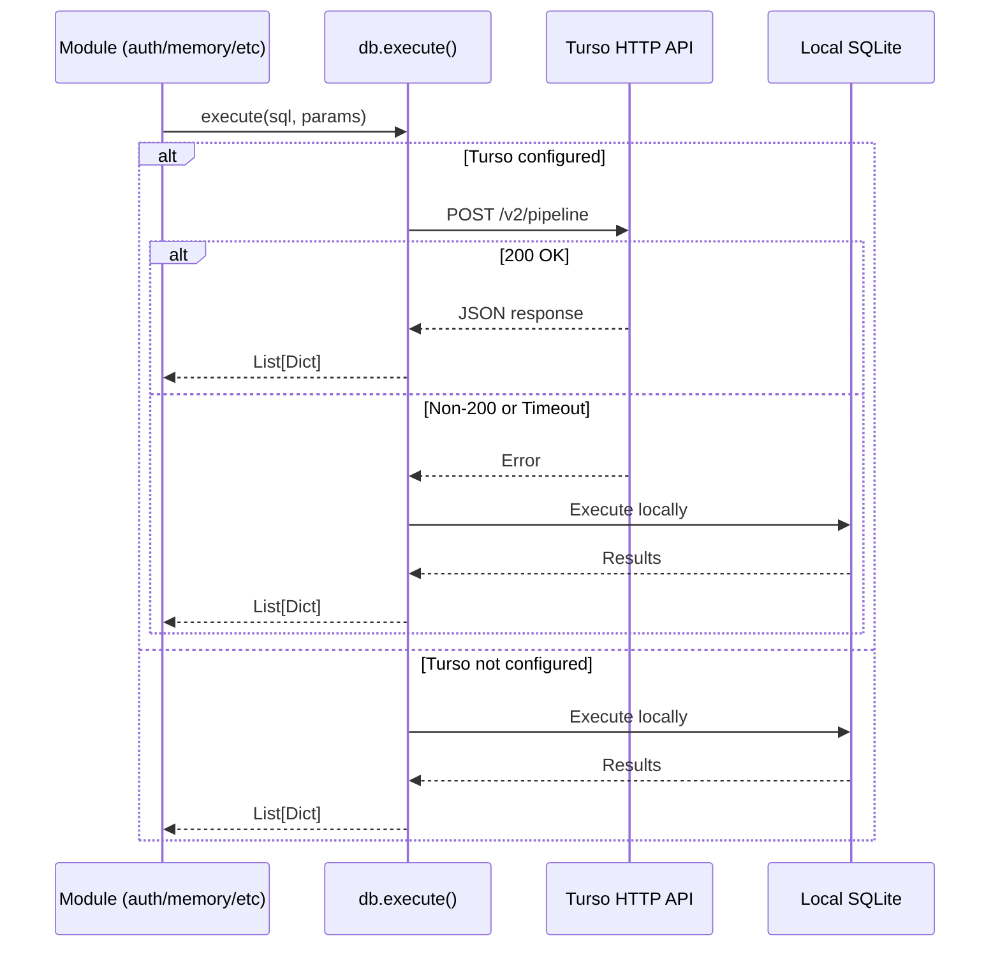

# Design Document: Turso Cloud Database

## Overview

This design replaces the current database module (`friday/db.py`) with an improved implementation that communicates with Turso's cloud-hosted libSQL database via the HTTP Pipeline API (`/v2/pipeline`). The module uses only Python's `requests` library — no native binary dependencies — making it fully compatible with Vercel's serverless Python runtime.

The architecture follows a primary/fallback pattern: Turso is the primary store for persistent data across deployments, while local SQLite at `/tmp/friday-data/friday.db` provides resilience when Turso is unreachable. All existing callers (`memory`, `auth`, `long_memory`, `rag`, `planner`) continue using the same `execute()` and `execute_insert()` API surface with no changes required.

### Key Design Decisions

1. **HTTP-only approach** — Uses `requests.post` against the `/v2/pipeline` endpoint rather than `libsql-experimental` or WebSocket connections. This eliminates the native binary dependency that causes deployment issues on Vercel.
2. **Transparent fallback** — Every query attempt that fails against Turso automatically retries on local SQLite. Callers never see connection errors.
3. **Parameter type fidelity** — Python types are mapped to Turso's typed value format (`text`, `integer`, `float`, `null`) to avoid silent type coercion.
4. **Module-level initialization** — Tables are created when the module is imported, matching the existing pattern and ensuring readiness before the first request.

## Architecture

```mermaid
graph TD
    A[Flask Routes] --> B[friday/db.py]
    B --> C{TURSO_DATABASE_URL & TURSO_AUTH_TOKEN set?}
    C -->|Yes| D[Turso HTTP Client]
    C -->|No| E[Local SQLite]
    D -->|POST /v2/pipeline| F[Turso Cloud Database]
    D -->|Error/Timeout| E
    E --> G[/tmp/friday-data/friday.db]
    
    H[config.py] -->|env vars| B
    I[Schema Initializer] -->|CREATE TABLE IF NOT EXISTS| B
```

### Request Flow



## Components and Interfaces

### 1. Configuration (`friday/config.py`)

Reads environment variables at import time. Already implemented — no changes needed.

| Variable | Type | Default | Purpose |
|----------|------|---------|---------|
| `TURSO_DATABASE_URL` | str | `""` | Turso database URL (libsql:// or https://) |
| `TURSO_AUTH_TOKEN` | str | `""` | Bearer token for Turso API authentication |

### 2. Database Module (`friday/db.py`)

The single module that owns all database I/O. Provides two public functions:

```python
def execute(sql: str, params: list = None) -> list[dict]:
    """Execute a SELECT/PRAGMA query. Returns list of row dicts."""

def execute_insert(sql: str, params: list = None) -> list[dict]:
    """Execute an INSERT/UPDATE/DELETE/CREATE. Returns empty list."""
```

### 3. Internal Components

#### TursoClient (internal)

Handles HTTP communication with the Turso pipeline API.

```python
# Module-level constants derived from env vars
TURSO_URL: str       # https:// base URL (libsql:// replaced)
TURSO_TOKEN: str     # Bearer token
USE_TURSO: bool      # True if both are non-empty, non-whitespace

def _turso_execute(sql: str, params: list) -> list[dict]:
    """Send query to Turso /v2/pipeline endpoint."""

def _serialize_param(value: Any) -> dict:
    """Convert a Python value to Turso typed parameter format."""
```

#### LocalSQLite (internal)

Handles local SQLite fallback operations.

```python
LOCAL_DB: Path = Path("/tmp/friday-data/friday.db")

def _local_execute(sql: str, params: list) -> list[dict]:
    """Execute query against local SQLite with parameterized execution."""
```

#### SchemaInitializer (internal)

Creates all required tables on module import.

```python
def init_tables() -> None:
    """Create all tables using CREATE TABLE IF NOT EXISTS."""
```

### 4. Health Endpoint Enhancement (`app.py`)

The existing `/health` route is updated to include database backend status:

```python
@app.route("/health")
def health():
    from friday.db import USE_TURSO
    return jsonify({
        "status": "running",
        "version": "2.1",
        "auth": "JWT",
        "rateLimit": "30/min on chat",
        "database": "turso" if USE_TURSO else "local_sqlite"
    })
```

## Data Models

### Turso Pipeline Request Format

```json
{
  "requests": [
    {
      "type": "execute",
      "stmt": {
        "sql": "SELECT * FROM users WHERE id = ?",
        "args": [
          {"type": "text", "value": "user-123"}
        ]
      }
    },
    {"type": "close"}
  ]
}
```

### Turso Pipeline Response Format

```json
{
  "baton": null,
  "base_url": null,
  "results": [
    {
      "type": "ok",
      "response": {
        "type": "execute",
        "result": {
          "cols": [
            {"name": "id", "decltype": "TEXT"},
            {"name": "email", "decltype": "TEXT"}
          ],
          "rows": [
            [{"type": "text", "value": "user-123"}, {"type": "text", "value": "a@b.com"}]
          ],
          "affected_row_count": 0,
          "last_insert_rowid": null
        }
      }
    }
  ]
}
```

### Parameter Type Mapping

| Python Type | Turso Type | Serialized Form |
|-------------|-----------|-----------------|
| `str` | text | `{"type": "text", "value": "hello"}` |
| `int` | integer | `{"type": "integer", "value": "42"}` |
| `float` | float | `{"type": "float", "value": 3.14}` |
| `None` | null | `{"type": "null"}` |
| `bool` (True) | integer | `{"type": "integer", "value": "1"}` |
| `bool` (False) | integer | `{"type": "integer", "value": "0"}` |
| Other | text | `{"type": "text", "value": str(val)}` |

### Database Schema

Seven tables (unchanged from existing schema):

| Table | Primary Key | Purpose |
|-------|-------------|---------|
| `users` | `id TEXT` | User accounts |
| `conversations` | `id INTEGER AUTOINCREMENT` | Chat message history |
| `memories` | `id INTEGER AUTOINCREMENT` | Short-term memories |
| `long_memory` | `id INTEGER AUTOINCREMENT` | Long-term user facts |
| `documents` | `id TEXT` | Uploaded document metadata |
| `chunks` | `id INTEGER AUTOINCREMENT` | Document text chunks for RAG |
| `plans` | `id INTEGER AUTOINCREMENT` | User plans and tasks |


## Correctness Properties

*A property is a characteristic or behavior that should hold true across all valid executions of a system — essentially, a formal statement about what the system should do. Properties serve as the bridge between human-readable specifications and machine-verifiable correctness guarantees.*

### Property 1: Configuration Detection

*For any* pair of strings (url, token), the `USE_TURSO` flag SHALL be `True` if and only if both strings are non-empty and contain at least one non-whitespace character. For all other combinations (empty string, None, whitespace-only), `USE_TURSO` SHALL be `False`.

**Validates: Requirements 1.1, 1.2, 2.8**

### Property 2: URL Scheme Normalization

*For any* valid URL string with a domain and optional path, if the input starts with `libsql://` then the output SHALL start with `https://` with the remainder of the URL preserved unchanged. If the input already starts with `https://`, the output SHALL be identical to the input.

**Validates: Requirements 1.3, 1.4**

### Property 3: Parameter Type Serialization Round-Trip

*For any* Python value of type `str`, `int`, `float`, `bool`, or `None`, the `_serialize_param` function SHALL produce a dictionary with a `"type"` field matching the Turso type mapping (str→text, int→integer, float→float, bool→integer, None→null) and a `"value"` field that can be used to reconstruct the original value (or its canonical representation). For any unsupported type, it SHALL produce `{"type": "text", "value": str(val)}`.

**Validates: Requirements 2.3, 9.1, 9.2, 9.3, 9.4, 9.5, 9.6**

### Property 4: Response Parsing Produces Column-Keyed Dictionaries

*For any* valid Turso pipeline response containing N columns and M rows, parsing SHALL produce a list of exactly M dictionaries where each dictionary has exactly the N column names as keys, and the corresponding row values as values. No keys are dropped, no extra keys are added.

**Validates: Requirements 2.4, 3.3**

### Property 5: Auth Token Never Appears in Logs

*For any* auth token string and any error scenario (non-200 response, timeout, connection failure), the token value SHALL NOT appear as a substring in any log output produced by the database module.

**Validates: Requirements 8.2, 8.5**

### Property 6: Error Response Log Truncation

*For any* error response body of arbitrary length, the portion logged by the database module SHALL be at most 200 characters long.

**Validates: Requirements 8.3**

### Property 7: Parameterized Queries Prevent SQL Injection

*For any* string value containing SQL metacharacters (quotes, semicolons, comments, DROP/DELETE keywords), when passed as a parameter to `_local_execute`, the value SHALL be stored and retrieved verbatim without being interpreted as SQL syntax.

**Validates: Requirements 3.7**

## Error Handling

### Error Categories and Responses

| Error Scenario | Behavior | Logging |
|---------------|----------|---------|
| Turso returns non-200 | Fall back to local SQLite for that query | `logger.error` with status code, truncated body (≤200 chars) |
| Turso request timeout (>10s) | Fall back to local SQLite for that query | `logger.error` with timeout message |
| Turso connection error (DNS, network) | Fall back to local SQLite for that query | `logger.error` with exception type |
| Local SQLite query error | Return empty list, do not raise | `logger.error` with exception details |
| Table creation failure | Log and continue to next table | `logger.error` with table name and error |
| Double failure (Turso + SQLite) | Return empty list, do not raise | `logger.error` for both failures |

### Error Handling Strategy

1. **No exceptions propagate to callers** — All database errors are caught internally. Callers always receive either valid results or an empty list.
2. **Graceful degradation** — Turso failure triggers automatic local fallback. The application remains functional even if cloud database is unreachable.
3. **Structured logging** — All errors are logged via `loguru` at error severity with enough context for debugging but without exposing credentials.
4. **Per-query fallback** — Each failing query independently falls back. A single Turso timeout doesn't disable Turso for subsequent queries.

### Security Considerations

- Auth token is read once at module initialization and stored in module-level variable
- Token is never logged, even partially
- Response bodies in error logs are truncated to 200 characters maximum
- No default/hardcoded credentials; missing env vars result in local-only operation
- All local SQLite queries use parameterized execution (prevents SQL injection)

## Testing Strategy

### Property-Based Tests (using Hypothesis)

The property-based testing library for this Python project is **Hypothesis**. Each property test runs a minimum of 100 iterations.

| Property | Test Description | Tag |
|----------|-----------------|-----|
| 1 | Generate random URL/token pairs, verify USE_TURSO correctness | Feature: turso-cloud-database, Property 1: Configuration Detection |
| 2 | Generate random URLs with libsql:// and https:// prefixes, verify normalization | Feature: turso-cloud-database, Property 2: URL Scheme Normalization |
| 3 | Generate random Python values of all types, verify serialization format | Feature: turso-cloud-database, Property 3: Parameter Type Serialization |
| 4 | Generate random column/row structures, verify parsed dict format | Feature: turso-cloud-database, Property 4: Response Parsing |
| 5 | Generate random tokens, trigger error paths, verify token absent from logs | Feature: turso-cloud-database, Property 5: Auth Token Not Logged |
| 6 | Generate random response bodies of varying length, verify log truncation | Feature: turso-cloud-database, Property 6: Log Truncation |
| 7 | Generate strings with SQL injection payloads, verify stored/retrieved verbatim | Feature: turso-cloud-database, Property 7: SQL Injection Safety |

### Unit Tests (example-based)

| Test | Validates |
|------|-----------|
| Headers include Authorization Bearer and Content-Type | Req 2.2 |
| Write operations return empty list | Req 2.5 |
| init_tables() is idempotent (calling twice doesn't error) | Req 4.8 |
| Table creation failure doesn't prevent other tables | Req 4.9 |
| Health endpoint returns correct database field | Req 7.1, 7.2, 7.3 |
| Health endpoint responds within 2s with 200 | Req 7.4 |
| execute_insert commits transaction locally | Req 6.3 |
| Double failure returns empty list | Req 6.5 |

### Integration Tests (mocked HTTP)

| Test | Validates |
|------|-----------|
| Turso non-200 triggers local fallback | Req 2.6, 3.6, 6.4 |
| Turso timeout triggers local fallback | Req 2.7 |
| Runtime network error triggers fallback | Req 1.5 |
| Data written to Turso is queryable (mock round-trip) | Req 5.1-5.5 |

### Test Configuration

- **Framework**: pytest + hypothesis
- **Minimum iterations**: 100 per property test (configured via `@settings(max_examples=100)`)
- **Mocking**: `unittest.mock.patch` for `requests.post` in integration tests
- **Log capture**: `loguru` sink capture for security/logging property tests
